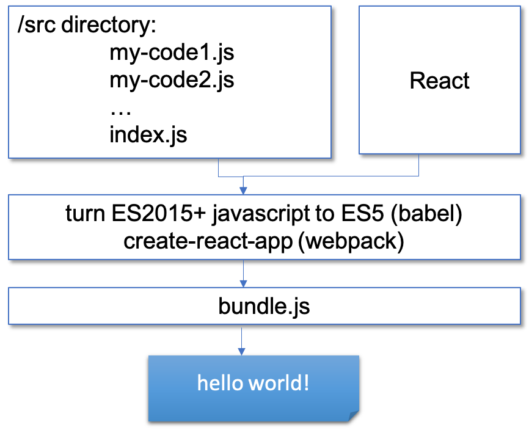
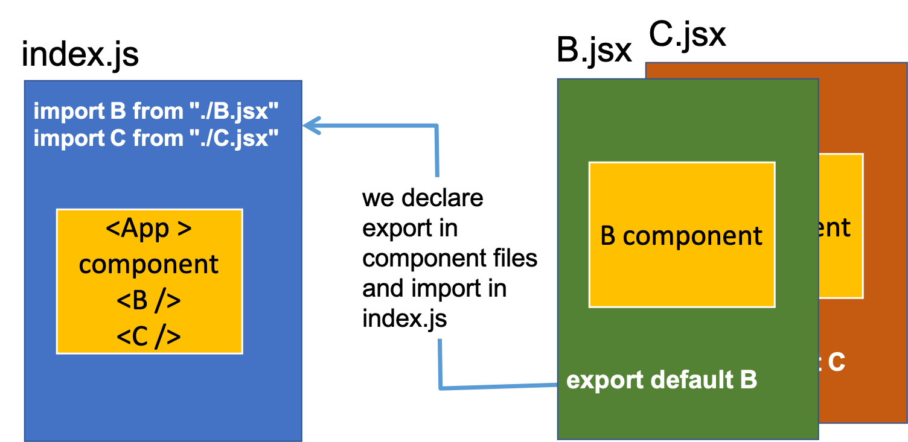
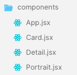
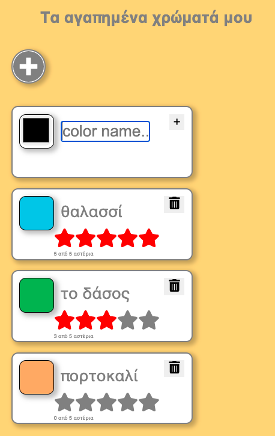
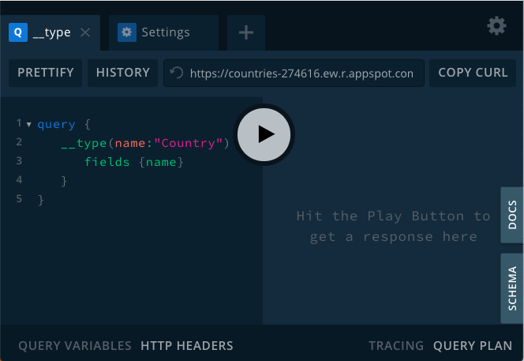

<div style = "border:5px solid lightgrey; padding:2rem">

<div style="font-size:1.5rem; line-height:1.1; margin: auto;">
Πανεπιστήμιο Πατρών, HCI Master, Μάθημα: Front-end programming - Ενότητα 8
</div>
<br />
<br />
<br />

<div style="font-size:5rem; line-height:1.1; margin: auto;">
 Εισαγωγή στη React
</div>


<div style="font-size:2rem; line-height:2; margin: auto;">
Νίκος Αβούρης
</div>

<div style="font-size:2rem; line-height:3; margin: auto;">
Πάτρα - Μάιος 2021
</div>

</div>

<div style="page-break-after: always"></div>
<div style="page-break-after: always"></div>


 # Εισαγωγή στη React 

### Μάθημα: Front-end programming - Ενότητα 8


## 8.1 Προοίμιο

* Η **React** (επίσης γνωστή ως React.js) είναι μια βιβλιοθήκη της JavaScript για τη δημιουργία διεπαφών χρήστη.

* Συντηρείται από την εταιρία Facebook και μια κοινότητα προγραμματιστών και εταιρειών. Κυκλοφόρησε για πρώτη φορά το 2011 (Jordan Walke)

* Η React μπορεί να χρησιμοποιηθεί ως βάση για την ανάπτυξη μιας ιστοσελίδας ή εφαρμογών για κινητά.

* Η React αφορά μόνο την εμφάνιση δεδομένων στο DOM, και έτσι η δημιουργία εφαρμογών React απαιτεί συνήθως τη χρήση πρόσθετων βιβλιοθηκών για διαχείριση της κατάστασης (Redux) και τη δρομολόγηση μεταξύ σελίδων (React Router).

* Η **React Native**, η οποία επιτρέπει την ανάπτυξη εγγενών εφαρμογών σε περιβάλλον Android, iOS και UWP (windows) με τη React, κυκλοφόρησε το 2015.

* Η React είναι επί του παρόντος η πιο δημοφιλής βιβλιοθήκη/ πλαίσιο JS στην πλευρά του χρήστη, σύμφωνα με την [έρευνα τεχνολογίας προγραμματιστών stackoverflow](https://insights.stackoverflow.com/survey/2020#technology).

<div style="page-break-after: always"></div>

## 8.2 Εισαγωγή

* Ο σκοπός της React είναι η εμφάνιση περιεχομένου (HTML) στον χρήστη και ο χειρισμός της αλληλεπίδρασης των χρηστών.

* Ο κώδικας εφαρμογής React αποτελείται από οντότητες που ονομάζονται **στοιχεία (components)**. Μεταβιβάζουμε δεδομένα στα στοιχεία, που ονομάζονται **ιδιότητες- properties (props)**.

* Μπορούμε να δηλώσουμε στοιχεία μέσω συναρτήσεων ή κλάσεων.

*Δήλωση μέσω συνάρτησης του στοιχείου Greeting*
```javascript
const Greeting = (props) => <div>Hello, {props.name}!</div>;
```
*Δήλωση μέσω κλάσης του στοιχείου ParentComponent*
```javascript
//class definition
class ParentComponent extends React.Component { 
	state = { color: 'green' }; 
	render() { 
		return ( 
			<ChildComponent color={this.state.color} /> ); } } 
```
* Η React χρησιμοποιεί την **JSX** (JavaScript XML) για να εμφανίσει τα στοιχεία (η σύνταξη της JSX είναι παρόμοια με αυτή της HTML)

* Η React επίσης επιτρέπει τον ορισμό *χειριστών συμβάντων (event handlers)*

* Χρησιμοποιούμε τις βιβλιοθήκες React και ReactDOM (για να χειριστούμε το DOM).


<div style="page-break-after: always"></div>


## 8.3 Ανάπτυξη εφαρμογής React με create-react-app 

Στην ενότητα αυτή θα δούμε πώς αναπτύσσουμε εφαρμογές react στον τοπικό μας υπολογιστή.

Θα χρησιμοποιήσουμε το module create-react-app του node.js


#### 1. Εγκατάσταση του Node JS αν δεν έχει ήδη εγκατασταθεί
* Ελέγξτε αν έχει ήδη εγκατασταθεί από γραμμή εντολών > node --version
* Αν ότι τότε προχωρήστε στην εγκατάστασή του από το [nodejs.org](https://nodejs.org/en/)

#### 2. Create-react-app
Εγκαθιστούμε και εκτελούμε στη συνέχεια το module `create-react-app` που δημιουργεί το περιβάλλον μιας εφαρμογής React. Η εκτέλεσή του γίνεται με χρήση της εντολής **npx** του node.js. (η npx είναι ένα εργαλείο package runner tool που έρχεται μαζί με το npm από την έκδοση 5.2 και μετά).

```shell
npm install –g create-react-app
npx create-react-app myapp 

Creating a new React app in ../react/code/myapp.

Installing packages. This might take a couple of minutes.
Installing react, react-dom, and react-scripts with cra-template...

⸨        ░░░░░░░░░░⸩ ⠸ extract:normalize-path: sill tarball trying read-pkg
...

Success! Created myapp at ...
Inside that directory, you can run several commands:

  npm start
    Starts the development server.

  npm run build
    Bundles the app into static files for production.

  npm test
    Starts the test runner.

  npm run eject
    Removes this tool and copies build dependencies, configuration files
    and scripts into the app directory. If you do this, you can’t go back!

We suggest that you begin by typing:

  cd myapp
  npm start

Happy hacking!
nma@nmac-001 code %

```
Σημείωση: η εντολή npx εκτελεί ένα script αφού το εγκαταστήσει αν δεν έχει εγκατασταθεί.

#### Σημείωση: για απεγκατάσταση
```shell
npm unistall –g create-react-app
rm –rf /usr/local/bin/create-react-app
```

#### 3. Εγκατάσταση και δημιουργία μιας νέας εφαρμογής React

```shell
npx --ignore-existing create-react-app myapp 
………
Installing packages. This might take a couple of minutes.
Installing react, react-dom, and react-scripts...
added 1810 packages from 770 contributors and audited 931495 packages in 165.644s
found 0 vulnerabilities
 
```

**Γιατί εγκαθίστανται τόσα πολλά εξαρτήματα ;** Παρατηρούμε ότι εκτός από τις τρεις βασικές βιβλιοθήκες react, react-dom, και react-scripts εγκαθίστανται στη συνέχεια βιβλιοθήκες όπως η Babel, Webpack, και Dev Server.

Ποιος είναι ο ρόλος τους; 

Η [Babel](https://babeljs.io/) είναι ένας μεταγλωττιστής JavaScript compiler (*transpiler*) που χρησιμεύει για μετατροπή κώδικα ECMAScript 2015+ σε παλαιότερη έκδοση της JavaScript, η οποία μπορεί να διερμηνευτεί σε παλαιότερους φυλλομετρητές. Ο ρόλος της Babel είναι:
* Μετασχηματίζει τον κώδικα ES2015+ σε ES5 ώστε να είναι συμβατός με τους περισσότερους φυλλομετρητές
* Μεταγλωττίζει την JSX σε JavaScript

[Webpack](https://webpack.js.org/) ένας στατικός συναθροιστής (static module bundler) εφαρμογών JavaScript. Όταν ο webpack επεξεργάζεται μια εφαρμογή, εσωτερικά παράγει ένα γράφο εξαρτήσεων που αντιστοιχεί κάθε module που απαιτεί το πρότζεκτ και δημιουργία ένα ενιαίο πακέτο.



#### Δομή αρχείων ενός πρότζεκτ React

```cli
Project directory
    /src (source code folder)
      /components
        App.jsx
        componentA.jsx
        componentB.jsx
      index.js
      stylesheet.css
    /public (static files folder, images, etc.)
      index.html
      img1.png
    /node_modules (project dependencies)
    package.json (file for configuration of dependencies)
    package-lock.json (exact version of packages installed)
    Readme.md (instructions file)
``` 

#### 4. Ανάπτυξη της εφαρμογής 

Η εφαρμογή μας θα πρέπει να έχει ορισμένη δομή. Το αρχείο που εκτελείται πρώτο είναι το `index.html` το οποίο περιέχει μόνο ένα στοιχείο html στο `<body>`, συνήθως το στοιχείο με `id="root`.

Ένα σημείο που πρέπει να προσέξουμε όταν χρησιμοποιούμε την create-react-app είναι ότι χρησιμοποιεί το Webpack μέσω του html-webpack-plugin. Η προκαθορισμένη του συμπεριφορά είναι να ορίζει στο αρχείο 
configuration ότι το src/index.js είναι το σημείο εισόδου στην εφαρμογή. Αυτό είναι το πρώτο module που φορτώνεται, και από αυτό όλα τα άλλα modules τα οποία μεταγλωττίζει στη συνέχεια σε ένα bundle. Δεν υπάρχει συνεπώς στοιχείο `<script>` στο αρχείο `index.html`.

[βλέπε συζήτηση  στο stackoverflow](https://stackoverflow.com/questions/42438171/wheres-the-connection-between-index-html-and-index-js-in-a-create-react-app-app)


#### 5. Μετά την ολοκλήρωση της ανάπτυξης, τρέχουμε την εφαρμογή myapp

```shell
cd myapp
npm start
...
Compiled successfully!

You can now view myapp in the browser.

  Local:            http://localhost:3000/
  On Your Network:  http://192.168.1.4:3000/

Note that the development build is not optimized.
To create a production build, use npm run build.

```

<div style="page-break-after: always"></div>


## 8.4 Ανάπτυξη εφαρμογής React με CodeSandbox

### Με χρήση του [CodeSandbox](https://codesandbox.io/)

* To [CodeSandbox](https://codesandbox.io/) είναι ένα διαδικτυακό περιβάλλον που επιτρέπει την ανάπτυξη εφαρμογών με React.
* Δημιουργούμε λογαριασμό χρήστη στο CodeSandbox με σύνδεση στο λογαριασμό μας στο github

* Δημιουργούμε ένα νέο sandbox χρησιμοποιώντας το React template, (react και react-dom είναι ήδη φορτωμένα στο τυπικό sandbox React)

* Στον φάκελο /public υπάρχει το αρχείο index.html, το οποίο διαμορφώνουμε ώστε να περιέχει το παρακάτω τμήμα body:

```html
  <body>
    <div id="root"></div>
    <script src="../src/index.js" type="text/javascript">
    </script>
  </body>
```
* επίσης το αρχείο /src/index.js περιέχει τα παρακάτω:

```javascript

import ReactDOM from "react-dom";

const rootElement = document.getElementById("root");
ReactDOM.render( <h1> καλή σας μέρα </h1>,
  rootElement
);
```

* Η μέθοδος `ReactDOM.render(component, target)` δέχεται ως πρώτο όρισμα ένα *στοιχείο HTML* που είναι γραμμένο σε **JSX** και ως δεύτερο όρισμα το *στοιχείο DOM στόχο*, συνήθως το μόνο στοιχείο html στο έγγραφο index.html.  

* Το *στοιχείο HTML* στην παραπάνω σύνταξη πρέπει να είναι μοναδικό στοιχείο HTML, εάν θέλουμε να αποδώσουμε περισσότερα από ένα στοιχεία, θα πρέπει να τα περιλάβουμε σε ένα στοιχείο υποδοχέα, π.χ. ένα `<div>`.


<div style="page-break-after: always"></div>

Οι δύο πιο σημαντικές βιβλιοθήκες της React που χρησιμοποιούμε είναι η React και η ReactDOM.
H React είναι η βιβλιοθήκη που χρησιμοποιείται για να καθορίζει την αναπαράσταση της διεπαφής μέσω της δημιουργίας στοιχείων React, και η ReactDOM είναι η βιβλιοθήκη που σχεδιάζει τα στοιχεία της διεπαφής στον φυλλομετρητή με χρήση του DOM API. 

Για παράδειγμα η React έχει τη μέθοδο `React.createElement(type, props, ...children);` ενώ η ReactDOM έχει τη μέθοδο `ReactDOM.render()`.

Στο React DOM τα αντικείμενα αναπαρίστανται ως αντικείμενα της JavaScript ως εξής:

```js
{
  $$typeof: Symbol(React.element),
  "type": "h1",
  "key": null,
  "ref": null,
  "props": {id: "recipe-0", children: "Baked Salmon"},
  "_owner": null,
  "_store": {}
}
```

Εμείς δεν χρειάζεται να αναφερθούμε απευθείας στα αντικείμενα του React DOM, απλά τα δημιουργούμε με κλήση συναρτήσεων-δημιουργών και χρήση της γλώσσας JSX που θα δούμε στη συνέχεια.

Παρατηρούμε ότι το αντικείμενο του React DOM pεριλαμβάνει `props.children` που αφορά τα "αντικείμενα" που περιέχονται στο συγκεκριμένο αντικείμενο.

Ας δούμε ένα παράδειγμα στο [χώρο πειραματισμού της Babel](https://babeljs.io/repl/#?browsers=defaults%2C%20not%20ie%2011%2C%20not%20ie_mob%2011&build=&builtIns=false&corejs=3.6&spec=false&loose=false&code_lz=MYewdgzgLgBAwiAtgB3AUzLAvDAZgVzGCgEtwAKZAJxGQgEoYBvAKAEgq0p8qwZyAPABMSANwB8zGNVoQAdIgCGiNDAC-AgPQiJ9ANzs1BoA&debug=false&forceAllTransforms=false&shippedProposals=false&circleciRepo=&evaluate=false&fileSize=false&timeTravel=false&sourceType=module&lineWrap=true&presets=react&prettier=false&targets=&version=7.14.3&externalPlugins=) που μετατρέπει την JSX σε JavaScript:

Έστω το αντικείμενο:

```js
const Component = function(props) {
	return (<div> { props.mame }</div>);
	};
  ```

  Θα παρατηρήσουμε ότι ο κώδικας JavaScript που παράγεται είναι:

  ```js
  const Component = function (props) {
  return React.createElement("div", null, " ", props.mame);
};
```

Με τη σειρά της μάλιστα η React.createElement() επιστρέφει ένα αντικείμενο, όπως το παρακάτω:
```js
{$$typeof: Symbol(react.element), type: "div", key: null, ref: null, props: {…}, …}
```


### 8.4.1 Διασύνδεση αρχείων javascript με import/export

Η JavaScript μέχρι πρόσφατα δεν είχε μηχανισμό για προγραμματισμό με modules που επιτρέπει το διαμοιρασμό της εφαρμογής σε αρθρώματα, δηλαδή σε πολλαπλά αρχεία.

Στο περιβάλλον node.js υπάρχει η δυνατότητα ενσωμάτωσης modules με τη μέθοδο `node.require()`.

Αυτός όμως δεν είναι ο επίσημος τρόπος εισαγωγής ενός module σε ένα πρόγραμμα JavaScript. Από την έκδοση της ES6 έχει εισαχθεί ο μηχανισμός import/export, ο οποίος χρησιμοποιείται στην React.

Σύμφωνα με τον μηχανισμό αυτό, κάθε αρχείο είναι ένα module, και οι σταθερές, μεταβλητές,συναρτήσεις και κλάσεις που ορίζονται μέσα σε αυτό είναι ιδιωτικές, μπορούν να εξαχθούν όμως από το module, μόνο αν αυτό δηλωθεί ρητά με την λέξη-κλειδί `export`. 

Η λέξη-κλειδί `export` μπορεί να χρησιμοποιηθεί είτε στον ορισμό του στοιχείου που θα εξαχθεί, είτε στο τέλος του κωδικα.

Για παράδειγμα:

```js
export const PI = Math.PI;

export class Circle {
  constructor(r) { this.r = r; }
  area() { 
    return PI * this.r * this.r; }
}
```
εναλλακτικά:

```js
export {PI, Circle};
```

Αν πρόκειται να εξαχθεί μόνο ένα στοιχείο χρησιμοποιούμε τις λέξεις κλειδιά `export default`:

```js
export default class Circle (){
  //κλάση
}
```

Οι μεταβλητές που εξάγονται από το module, μπορούν να εισαχθούν σε ένα άλλο αρχείο αν δηλωθούν ρητά με τη λέξη-κλειδί `import`.

Η εισαγωγή μοναδικών στοιχείων που έχουν εξαχθεί με τη δομή export default είναι συντακτικά πιο απλή. 

```js
import Circle from "./Geometry.js";
```
Αν όμως εξάγονται περισσότερα στοιχεία χρησιμοποιείται η εξής σύνταξη:

```js 
import { PI, Circle } from "./Geometry.js";
```
Στις εφαρμογές React θα δούμε χρήση και των δύο αυτών τρόπου εισαγωγής/εξαγωγής στοιχείων: (α) import για εισαγωγή στοιχείων στο πατρικό στοιχείο, και (β) την εξαγωγή ενός στοιχείου στο αρχείο μέσα στο οποίο ορίζεται.

## 8.5 Εισαγωγή στην JSX

* Η **JSX** είναι μια διάλεκτος της JavaScript που επιτρέπει τη χρήση κώδικα που μοιάζει με HTML για τη δημιουργία διεπαφής χρήστη μέσω *στοιχείων React*. Ένα στοιχείο React περιέχει HTML για εμφάνιση στον χρήστη και *χειριστές* για χειρισμό ενεργειών του χρήστη στο στοιχείο.
 

### Διαφορές της JSX από την HTML 

#### 1. Μπορούμε να περιλάβουμε εκφράσεις javascript μέσα σε κώδικα JSX με χρήση `{jsVariable}`

*παράδειγμα:* Έστω ότι στον κώδικα του πρώτου παραδείγματος θέλουμε να ενσωματώσουμε την μεταβλητή `name`:

```javascript
import ReactDOM from "react-dom";
const name = "Μαρία"
const rootElement = document.getElementById("root");
ReactDOM.render( <h1> καλή σας μέρα αγαπητή {name} </h1>,
  rootElement
);
```

#### 2. Η επιβολή στυλ στα στοιχεία γίνεται μέσω αντικειμένων JavaScript `{elem: value}`

*παράδειγμα:* τροποποιήστε τον κώδικα ώστε να επιβληθεί ένα στυλ που επιβάλει ένα μπλε πλαίσιο στο μήνυμά μας.   

```javascript
import ReactDOM from "react-dom";
const name = "Μαρία"
const myStyle = {border:'2px solid blue'}
const rootElement = document.getElementById("root");
ReactDOM.render( <h1 style={myStyle}> καλή σας μέρα αγαπητή {name} </h1>,
  rootElement
);
```

#### 3. Χρήση του γνωρίσματος `className` αντί για `class` στα στοιχεία HTML

Αυτό γίνεται γιατί η λέξη `class` είναι δεσμευμένη λέξη της JavaScript (στη δήλωση κλάσεων).

*παράδειγμα* αν στο αρχείο /public/index.html ορίσουμε το παρακάτω στυλ:
```html
<style>
    .h1class {font-family: sans-serif; border: 2px solid blue}
</style>
```
τότε μπορούμε να τροποποιήσουμε τον κώδικα JSX στο αρχείο src/index.js ως ακολούθως:

```javascript
import ReactDOM from "react-dom";
const name = "Μαρία";
const rootElement = document.getElementById("root");
ReactDOM.render(
  <h1 className="h1class"> καλή σας μέρα αγαπητή {name} </h1>,
  rootElement
);
```
#### 4. Χρήση της `htmlFor` αντί για `for` ως γνώρισμα στοιχείων

Επειδή η `for` είναι δεσμευμένη λέξη της JavaScript, δεν μπορούμε να την χρησιμοποιήσουμε ως γνώρισμα ενός στοιχείου JSX.

Για παράδειγμα ο παρακάτω κώδικας HTML:

```html
<label className="label" for="name">        
```
σε JSX θα πρέπει να γραφτεί ως εξής:

```javascript
<label className="label" htmlFor="name">
```


#### 5. Όλα τα γνωρίσματα HTML αλλάζουν σε camelCase για να χρησιμοποιηθούν ως μεταβλητές javascript

Τα [γνωρίσματα HTML ](https://www.w3schools.com/tags/ref_standardattributes.asp) περιλαμβάνουν τα: `contenteditable`, `spellcheck`, κλπ., αυτά αν χρησιμοποιηθούν στην JSX πρέπει να γίνουν camelCase, δλδ.`contentΕditable`, κλπ.
(συζήτηση για στυλ μεταβλητών, π.χ. camelCase, PascalCase, snake_case, kebab-case θα βρείτε στο [medium](https://betterprogramming.pub/string-case-styles-camel-pascal-snake-and-kebab-case-981407998841))

#### 6. Η JSX είναι αυστηρή (όπως και η XML) στα ζευγάρια ετικετών

*παράδειγμα:*
Το παρακάτω στοιχείο δεν είναι αποδεκτό στην JSX:
``

Η σωστή μορφή είναι:
`` 
(ετικέτα που κλείνει)

### Παράδειγμα 1 (ex1)

Η ιστοσελίδα [picsum](https://picsum.photos/) επιτρέπει να κατεβάζουμε τυχαίες εικόνες διαστάσεων x μέσω του url: https://picsum.photos/x

Για παράδειγμα η διεύθυνση https://picsum.photos/200 θα επιστρέψει μια τυχαία σελίδα διαστάσεων 200x200 pixel.

Επίσης η https://picsum.photos/200?grayscale επιστρέφει μια τυχαία εικόνα διαστάσεων 200x200 σε αποχρώσεις του γκρι.

```text
Προσαρμόστε το παράδειγμα ώστε να δημιουργήσετε μια σελίδα με κεφαλίδα (h1) "Η αγαπημένη μου εικόνα:" που ακολουθείται από μια εικόνα 300x300 pixels
```

### Μέρος Β

Η `new Date() ` επιστρέφει την τρέχουσα ημερομηνία, και η μέθοδος `getHours()` του αντικειμένου Date επιστρέφει την ώρα της μέρας με τιμή από 0 στο 23. Συμπληρώστε την σελίδα ώστε να εμφανίζει το καλωσόρισμα "Καλημέρα" αν είναι από 0 μέχρι 12, "Καλησπέρα" αν είναι από 12 σε 18, "Καλό βράδυ" αν είναι από 18 σε 21, και "Καληνύχτα" αν είναι από 21 μέχρι 23.


<div style="page-break-after: always"></div>


## 8.6 Στοιχεία React

### Τα στοιχεία(components) React μπορούν να δημιουργηθούν με συναρτήσεις ή κλάσεις.

Η δημιουργία **στοιχείων React** μέσω κλάσεων δεν θεωρείται πλέον καλή πρακτική. Από την έκδοση React 16.8 με την εισαγωγή των hooks, τα συναρτησιακά στοιχεία, τα οποία είναι απλούστερα, μπορούν να χειριστούν πλεον τα δεδομένα της κατάστασης του στοιχείου, οπότε δεν είναι απαραίτητη πια η χρήση κλάσεων. Στη συνέχεια θα χρησιμοποιήσουμε μόνο συναρτησιακά στοιχεία.

#### Παράδειγμα: δημιουργία στοιχείου μέσω συνάρτησης

```javascript
// Δημιουργία στοιχείου React 
const App = function() {   // το όνομα σε Pascal case.
    return <div> Καλή σας μέρα! </div>;};

// Δείξε το στοιχείο στην οθόνη
ReactDOM.render(<App />, document.querySelector("#root") );
```
Ένα στοιχείο React σχεδιάζει ένα τμήμα της διεπαφής χρήστη. Ορίζεται μέσω μιας συνάρτησης που επιστρέφει το αντικείμενο. 

Η σχεδίαση του στοιχείου γίνεται:
* όταν φορτώνεται η εφαρμογή **για πρώτη φορά** 
* όταν αλλάζουν οι τιμές των **ιδιοτήτων (props)** 
* ή όταν αλλάζει η **κατάσταση (state)**.
 

### Ενσωμάτωση στοιχείων React 

* Μπορούμε να ενσωματώσουμε στοιχεία React (components) μέσα σε άλλα στοιχεία.

* Γενικά είναι καλή πρακτική να αφιερώνουμε ένα αρχείο .jsx για κάθε στοιχείο React.  

* Ο μηχανισμός ενσωμάτωσης στηρίζεται στην εξαγωγή (export) του στοιχείου στο αρχείο του ίδιου του στοιχείου και εισαγωγή του (import) στο αρχείο του πατρικού στοιχείου.  

* Στην εικόνα βλέπουμε την ενσωμάτωση των δύο στοιχείων `<B />` και `<C />` στο πατρικό στοιχείο `<App />`.




<div style="page-break-after: always"></div>


## 8.7 Ιδιότητες των στοιχείων React (props)

Μπορούμε να ορίσουμε τις ιδιότητες ενός στοιχείου React (props), ώστε να μπορούμε να περάσουμε τις τιμές αυτών των ιδιοτήτων κατά τη χρήση του στοιχείου, όπως για παράδειγμα, τις τιμές που λαμβάνουν τα χαρακτηριστικά ενός στοιχείου HTML.

Με αυτόν τον τρόπο μπορούμε να προσαρμόσουμε την εμφάνιση των στοιχείων, μέσω των δεδομένων που διαβιβάζονται σε αυτά, ως props.


*Παράδειγμα:*

```javascript
const Component = function(props) {
	return (<div> { props.mame }</div>);
	};
```

Μπορούμε να χρησιμοποιήσουμε το στοιχείο αυτό ως ακολούθως:  

```jsx
<Component name="Καποδίστριας" />
```

Σε αυτή την περίπτωση η τιμή που περνάει στο στοιχείο είναι όπως φαίνται παρακάτω ένα αντικείμενο:

```javascript
console.log(props)
>> {name: "Καποδίστριας"}
```

Φαίνεται επίσης ότι οι ιδιότητες ορίζονται  στα αντικείμενα με σύνταξη που θυμίζει τα γνωρίσματα των στοιχείων HTML.

### Η πρώτη μας εφαρμογή: heroes21

Η πρώτη εφαρμογή μας έχει στόχο την δημιουργία μιας ιστοσελίδας με τις προσωπικότητες της Ελληνικής επανάστασης του 1821. 

Κατ' αρχάς συγκεντρώνουμε από διάφορες πηγές στοιχεία για κάποιες προσωπικοτήτες, Έλληνες και ξένους που έπαιξαν ρόλο στην επανάσταση. Τα συγκεντρώνουμε σε ένα αρχείο `heroes21.js` που έχει την εξής δομή:

```javascript
export default const heroes21 = [
  {
    id: "1",
    name: "Θεόδωρος Κολοκοτρώνης",
    imgURL:
      "https://upload.wikimedia.org/wikipedia/commons/4/4b/Kolokotronis01.jpg",
    life: "Αρχιστράτηγος, οπλαρχηγός, Μεσσηνία, 1770 - Αθήνα, 1843"
  },
  {
    id: "2",
    name: "Παλαιών Πατρών Γερμανός",
    imgURL:
      "https://upload.wikimedia.org/wikipedia/commons/4/48/Palaion_Patron_Germanos_1865_002.JPG",
    life: "Ιεράχης, φιλικός, Δημητσάνα Αρκαδίας, 1771 - Ναύπλιο, 1826 "
  }]
```
Το αρχείο θα βρείτε στο υλικό του μαθήματος, όμως εσείς μπορείτε να το εμπλουτίσετε προσθέτoντας τις προσωπικότητες που θεωρείτε σημαντικές για την εξέγερση του 2021, φιλέλληνες, πολιτικούς, αγωνιστές, διανοούμενους, κ.λπ.)

Στόχος είναι να δημιουργήσουμε μια εφαρμογή όπως το ακόλουθο παράδειγμα:
 


Την εφαρμογή μπορείτε να δείτε σε λειτουργία στο netlify: [heroes of 1821](https://csb-et05o.netlify.app/)

Ξεκινάμε στο [codesandbox.io](https://codesandbox.io) ένα καινούργιο project χρησιμοποιώντας το React template. 

Στην εφαρμογή έχουν ήδη περιληφθεί τα εξής εξαρτήματα: react, react-dom και react-scripts.

Δομούμε την εφαρμογή ως εξής: έχουμε δύο φακέλους: `public` και `src`. 

Στον πρώτο έχουμε το αρχείο `index.html`, το οποίο εκτός από τον τίτλο και σύνδεσμο στο αρχείο `index.js` που θα τοποθετήσουμε στο φάκελο `src` έχει μόνο ένα στοιχείο το `<div id="root"></div>`. Εδώ τελειώνει ουσιαστικά η HTML και αρχίζει η React.


```html
<!DOCTYPE html>
<html lang="en">
  <head>
    <meta charset="utf-8" />
    <title>Μορφές του 1821</title>
    <link rel="stylesheet" href="styles.css" />
  </head>

  <body>
    <div id="root"></div>
    <script src="../src/index.js" type="text/jsx"></script>
  </body>
</html>
```
Στον φάκελο `public` επίσης δημιουργούμε το αρχείο `styles.css`, όπου σταδιακά θα ορίσουμε την εμφάνιση των κλάσεων CSS που θα καθορίσουν την εμφάνιση των στοιχείων της διεπαφής. Για παράδειγμα της κλάσης `.heading` για την κεφαλίδα, της κλάσης `.card` για την κάρτα του ήρωα, την `.circle-img` για την εμφάνιση της εικόνας, κλπ. 

Στον φάκελο `src` περιέχονται τα δεδομένα των ηρώων (αρχείο `heroes.js`), το αρχικό αρχείο της εφαρμογής React είναι το `index.js` που όπως είδαμε εισάγει το ριζικό στοιχείο React, το στοιχείο `<App>` και το εμφανίζει, μαζί του θα εμφανίσει όλη την ιεραρχία στοιχείων που θα χτίσουμε κάτω από το στοιχείο `<App>` :

```javascript
import React from "react";
import ReactDOM from "react-dom";
import App from "./components/App";

ReactDOM.render(<App />, document.querySelector("#root"));
```
Δημιουργούμε στη συνέχεια στον φάκελο `src` ένα φάκελο `components` στον οποίο θα τοποθετήσουμε όλα τα στοιχεία React που θα δημιουργήσουμε.

Το καθένα από αυτά τα στοιχεία περιέχεται σε ένα αρχείο `.jsx`:



Η ιεραρχία που ορίζουμε είναι ότι στο στοιχείο `<App>` περιέχονται στοιχεία `<Card>` ( η κάρτα ενός ήρωα), σε καθένα από τα οποία περιέχεται ένα στοιχείο `<Detail>` (το όνομα και το βιογραφικό του), και ένα στοιχείο `<Portrait>` (η φωτογραφία του).

Είναι φανερό ότι στο στοιχείο `<App>` θα πρέπει να ενσωματώσουμε πολλαπλά στοιχεία `<Card>` τόσα όσοι και οι ήρωες που περιέχονται στον πίνακα `heroes21`.

Είναι συνηθισμένη η χρήση συναρτησιακού προγραμματισμού στο σημείο αυτό, και ιδιαίτερα της συνάρτησης `map` η οποία εφαρμόζει το όρισμά της, που είναι μια συνάρτηση, σε ένα προς ένα τα στοιχεία του πίνακα και επιστρέφει ένα νέο πίνακα.

Το στοιχείο `<App>` συνεπώς ορίζεται ως εξής:

```JSX
export default function App() {
  return (
    <div>
      <h1 className="heading">Μορφές του '21</h1>
      {heroes21.map(createCard)}
    </div>
  );
}
```
Η συνάρτηση `CreateCard` πρέπει για κάθε στοιχείο του πίνακα `heroes21` να επιστρέφει ένα στοιχείο τύπου `<Card>` στο οποίο να περνάμε ως props τα δεδομένα του αντίστοιχου ήρωα:

```JSX
function createCard(hero) {
  return (
    <Card
      key={hero.id}
      name={hero.name}
      img={hero.imgURL}
      attr={hero.attr}
      life={hero.life}
    />
  );
}
```
Άρα στο σημείο αυτό της <App> θα έχουμε ένα πίνακα από στοιχεία `<Card>`:

`[<Card />, <Card /> ... <Card />]`

Σε κάθε περίπτωση που ορίζουμε ένα τέτοιο πίνακα στοιχείων React, είναι απαραίτητο καθένα από αυτά να έχει μια ιδιότητα `key` που να παίρνει μοναδική τιμή. Στην περίπτωσή μας χρησιμοποιήσαμε το γνώρισμα `hero.id` που είναι μοναδικό, αν δεν υπήρχε θα έπρεπε να δημιουργήσουμε εμείς ένα μοναδικό κλειδί για κάθε στοιχείο.

Πάμε στη συνέχεια να δούμε, πώς θα χρησιμοποιήσουμε τις ιδιότητες που έχουμε περάσει σε κάθε `<Card>`.

```JSX
export default function Card(props) {
  return (
    <div className="card">
      <div className="top">
        <h2 className="name">{props.name}</h2>
        <Portrait img={props.img} attr={props.attr} />
      </div>
      <div className="bottom">
        <Detail detailInfo={props.life} />
      </div>
    </div>
  );
}
```
Όπως βλέπουμε το κάθε τέτοιο στοιχείο εμφανίζει το όνομα του ήρωα το οποίο υπάρχει στην ιδιότητα `name`:
```JSX
<h2 className="name">{props.name}</h2>
```
ενώ περνάει τις υπόλοιπες ιδιότητες στα στοιχεία `<Portrait>` και `<Detail>`. Αυτά τα στοιχεία είναι ιδιαίτερα απλά, αφού το μόνο που κάνουν είναι να δημιουργήσουν ένα στοιχείο HTML με τις πληροφορίες που πήραν από τις ιδιότητες props :

```html
export default function Detail(props) {
  return <p className="info">{props.detailInfo}</p>;
}
```
και το στοιχείο `<Portrait>`:

```html
export default function Portrait(props) {
  return ;
} 
```

<div style="page-break-after: always"></div>


## 8.8 Τα Hooks και η διαχείριση κατάστασης

* Ως **Κατάσταση (State)** ορίζεται το σύνολο των δεδομένων της ιεραρχίας των στοιχείων React, που μπορούν να αλλάξουν κατά τη χρήση της εφαρμογής.

* Σε μια εφαρμογή React, έχουμε δεδομένα σε δύο μορφές: ως **ιδιότητες (props)** που μεταβιβάζονται από στοιχείο σε στοιχείο της ιεραρχίας, όπως είδαμε στο παράδειγμα της προηγούμενης ενότητας, και ως **κατάσταση (state)** που είναι δεδομένα που συνήθως αποθηκεύονται σε ένα μέρος, πιο συχνά στη ρίζα του δέντρου.

* Υπάρχει συσχέτιση μεταξύ δεδομένων **κατάστασης (state)** και **ιδιοτήτων (props)**: όταν αλλάζουν οι μεταβλητές κατάστασης, η αλλαγή επηρεάζει τις ιδιότητες που διαβιβάζονται στα στοιχεία της ιεραρχίας.

* Επίσης οι ενέργειες του χρήστη ενδέχεται να αλλάξουν τα δεδομένα της κατάστασης και οι νέες αυτές τιμές πρέπει να σταλούν πίσω στην κορυφή του δέντρου, όπου αποθηκεύεται η κατάσταση, από τα στοιχεία στα οποία έγινε η αλληλεπίδραση με τον χρήστη.

* Ακόμη σχετικά με την κατάσταση είναι τα δεδομένα που συλλέγονται από τον χρήστη από φόρμες, στις οποίες ο χρήστης εισάγει δεδομένα, ή αλλάζει την κατάστση στοιχείων φόρμας.

* Υπάρχουν διάφοροι μηχανισμοί για διατήρηση της κατάστασης στην React. Στο παρελθόν κύρια χρησιμοποιούσαμε τα στοιχεία-αντικείμενα στα οποία η διατήρηση της κατάστασης ήταν εφικτή, ενώ στα στοιχεία-συναρτήσεις αυτό δεν ήταν δυνατόν. Με την έκδοση 16.8 (το 2018) όμως εισήχθη η δυνατότητα δημιουργίας **hooks** και μέσω αυτών είναι δυνατή η διαχείριση της κατάστασης σε στοιχεία-συναρτήσεις, όπως αυτά που έχουμε δει ως τώρα.

* Ο μηχανισμός που χρησιμοποιείται για τη διατήρηση και την αλλαγή της κατάστασης, είναι **hooks**, ειδικότερα, το hook `useState()`. Υπάρχουν και άλλα hooks που μπορούν να χρησιμοποιηθούν για την προσθήκη λειτουργικότητας στα στοιχεία μας, όπως αποστολή/λήψη των δεδομένων κατάστασης στον εξυπηρετητή. Τα hooks που θα δούμε σε αυτά τα μαθήματα είναι τρία: το `useState()` για διαχείριση κατάστασης, το `useEffect()` για ορισμό παρενεργειών υπό συνθήκη, και το `useContext()` για δημιουργία ενός περιβάλλοντος μέσα στο οποίο μπορούμε να διαθέτουμε και να καταναλώνουμε δεδομένα. Εκτός από αυτά τα τρία, υπάρχουν και άλλα hooks, όπως το `useRef()` που θα αναφερθεί στη συνέχεια, τα οποία χρησιμοποιούνται λιγότερο, περισσότερες λεπτομέρειες [στα tutorial της React](https://reactjs.org/docs/hooks-intro.html).

Θα πρέπει πριν προχωρήσουμε με το hook ορισμού μεταβλητών κατάστασης, να γίνει αναφορά σε μερικούς βασικούς κανόνες που ισχύουν για τα hooks.

* Τα hooks είναι συναρτήσεις της JavaScript με ιδιαίτερη χρήση. 
* Η κλήση των hooks μπορεί να γίνει μόνο μέσα από **συναρτησιακά στοιχεία React**.
* Μπορούμε να καλέσουμε ένα hook μόνο στο υψηλότερο επίπεδο του στοιχείου, άρα δεν μπορούμε να καλέσουμε ένα hook μέσα σε βρόχους επανάληψης, σε δομές συνθήκης, ή σε ενσωματωμένες συναρτήσεις.


### Ορισμός μεταβλητών κατάστασης (State variable)

Έστω ότι επιθυμούμε να ορίσουμε μια μεταβλητή κατάστασης `starRating`, ή οποία είναι η μεταβλητή που ορίζει τη βαθμολογία ενός προϊόντος με ένα σύστημα από 0 έως 5 αστέρια. Η βαθμολογία αυτή μπορεί να αλλάξει για ένα προϊόν, ως αποτέλεσμα επιλογής του χρήστη. Ο ορισμός της ως μεταβλητής κατάστασης γίνεται ως εξής:

```javascript
import React, { useState } from "react";

const [starRating, setStarRating] = useState(0)
```

Ορίζουμε την μεταβλητή κατάστασης `starRating` καθώς και μια συνάρτηση μεταβολής της μεταβλητής κατάστασης `setStatRating()` οι οποίες ορίζονται με αποδόμηση του πίνακα που επιστρέφει η μέθοδος `useState(αρχική-τιμή)`. Στο παράδειγμά μας, η μεταβλητή `starRating` έχει ως αρχική τιμή = 0. 

Όταν καλέσουμε τη συνάρτηση `setStatRating()` θα αλλάξει η τιμή της μεταβλητής κατάστασης, με βάση την τιμή που θα περάσουμε στο όρισμά της. Για παράδειγμα αν θέλουμε να αλλάξουμε την τιμή της μεταβλητής σε 5 :
```javascript
setStarRating(5)
````
Ενώ αν θέλουμε να αυξήσουμε την τιμή της μεταβλητής κατάστασης κατά 1:
```javascript
setStarRating(starRating + 1)
````
Είναι συνηθισμένο στη συνάρτηση `setStatRating()` να περνάμε ως όρισμα μια άλλη συνάρτηση `f()`, η οποία να παίρνει ως όρισμα την προηγούμενη τιμή της μεταβλητής κατάστασης και να επιστρέφει τη νέα τιμή.

```javascript
function f(prev){
  // υπολογισμός νέας τιμής
  return newStateValue;
}
```

Για να αλλάξουμε την κατάσταση σε κάποιο σημείο του δένδρου στοιχείων, διαφορετικό από τον κόμβο στον οποίο συντηρούμε την κατάσταση, συνηθίζεται να στέλνουμε μέσω των props μια συνάρτηση, η οποία όταν κληθεί θα τροποποιήσει την κατάσταση.  

### Παράδειγμα: ένα σύστημα αξιολόγησης ενός προϊόντος με αστέρια  

Στην ενότητα αυτή θα δούμε ένα παράδειγμα στο οποίο απαιτείται η διαχείριση μιας μεταβλητής κατάστασης.

Θα δημιουργήσουμε ένα στοιχείο React που μάς επιτρέπει να βαθμολογήσουμε ένα προϊόν με μια κλίμακα 5 αστέρων. Ο χρήστης θα επιλέγει ένα αστέρι και τα αντίστοιχα αστέρια μέχρι εκείνο που επέλεξε ο χρήστης, θα αλλάζουν σε κόκκινο από γκρι που είναι η αρχική τους κατάσταση, ενώ ένα σχετικό μήνυμα θα εμφανίζεται στο κάτω μέρος της εικόνας.


Τα αρχεία που θα δημιουργήσουμε στην εφαρμογή αυτή φαίνονται στη συνέχεια.


Το στοιχείο index.js είναι όπως και προηγουμένως:

```javascript
import React from "react";
import ReactDOM from "react-dom";
import App from "./components/App";
import "./styles.css"

const rootElement = document.querySelect("#root");
ReactDOM.render(
    <App className="App" />,
  rootElement
);
```
Ενώ το αρχείο styles.css το εξής:

```javascript
.App {
  font-family: sans-serif;
  text-align: center;
  font-size: 1.2em;
  border: 1px solid bla;
}
```

Στον φάκελο components έχουμε τα εξής στοιχεία React:

**App.jsx**
Το στοιχείο αυτό που είναι η ρίζα της ιεραρχίας των στοιχείων μας ορίζουμε τη μεταβλητή κατάστασης `starRating`, στην οποία θα αποθηκεύσουμε τη βαθμολογία του χρήστη, η μεταβλητή αρχικοποιείται στην τιμή 0.

Θα πρέπει να προσέξουμε ότι hooks όπως αυτό που δημιουργείται με κλήση της `useState()` επιτρέπεται να οριστούν μόνο μέσα σε στοιχεία React.


```JSX
import React, {useState} from "react";
import Rating from "./Rating"

const totalStars = 5;

export default function App(prop) {

  const [starRating, setStarRating] = useState(0); //μεταβλητή κατάστασης

  function selectStar(id){ //συνάρτησης αλλαγής της μεταβλητής κατάστασης
    if (id>=0 && id <= totalStars)setStarRating(id+1)
  }

  return (
    <div className={prop.className}>
      <h1>Βαθμολογία</h1>
      <Rating 
        stars = {starRating} 
        totalStars ={totalStars} 
        selectStar={selectStar}/>
    </div>
  );
}
```

Η τιμή της μεταβλητής κατάστασης μεταδίδεται προς τα κάτω στο δέντρο των στοιχείων React, ώστε να επιτρέπεται στα στοιχεία που εμφανίζουν τα αστέρια να τα εμφανίσουν ως κόκκινα ή γκρι, ανάλογα με την τιμή αυτής της μεταβλητής. Η κατάσταση μεταφέρεται προς τα κάτω μέσω της ιδιότητας `stars` που διαβιβάζεται στο στοιχείο `Rating`:

```javascript
stars = {starRating}
```

Στο στοιχείο `<App>` επίσης ορίζουμε τη συνάρτηση `selectStar()` η οποία θα πρέπει να κληθεί κάθε φορά που ο χρήστης επιλέγει ένα αστέρι, αυτή λαμβάνει ως όρισμα τον κωδικό του αστεριού που πατήθηκε από τον χρήστη (το id παίρνει τιμές από 0, έως 4) και τροποποιεί τη μεταβλητή κατάστασης με κλήση της συνάρτησης `setStarRating()`. 

Αυτή η συνάρτηση όμως δεν χρησιμοποιείται στο στοιχείο `<App>`. Στο στοιχείο αυτό δεν υπάρχουν αστέρια, και ο χρήστης δεν μπορεί να τους αλλάξει την κατάσταση, τα αστέρια όπως θα δούμε στη συνέχεια σχεδιάζονται στο στοιχείο `<Star>`. Η συνάρτηση αυτή λοιπόν θα χρειαστεί πιο κάτω στην ιεραρχία των στοιχείων μας. 

Ο τρόπος για να την διαθέσουμε στα στοιχεία που την χρειάζονται είναι να την περάσουμε ως ιδιότητα προς τα κάτω, ώστε να φτάσει τελικά στο στοιχείο  `<Star>` που βρίσκεται στο κάτω μέρος της ιεραρχίας, και εκεί θα κληθεί για να τροποιποιήσει την τιμή της μεταβλητής κατάστασης `starRating`.

Η μεταβίβαση της συνάρτησης αυτής ως ιδιότητας, γίνεται ως εξής (*προσοχή η πρώτη μεταβλητή είναι η ιδιότητα prop, ενώ η δεύτερη είναι η συνάρτηση που έχει το ίδιο όνομα* ):

```javascript
selectStar = {selectStar}
```
Τέλος το τρίτο στοιχείο που πρέπει να μεταφέρουμε προς τα κάτω είναι η τιμή της σταθεράς `totalStars` η οποία δηλώνει πόσα αστέρια πρέπει να σχεδιαστούν (υποθέτουμε ότι η κλίμακα είναι 5 αστέρων).

**Rating.jsx**

Το επόμενο στοιχείο της ιεραρχίας είναι το `<Rating />`

```javascript
import React from "react";
import Star from "./Star"

export default function Rating(prop){
  const rating = prop.stars;
  const totalStars = prop.totalStars;
  const createArray = length => [...Array(length)];

  return (
    <div>
      {createArray(totalStars).map((n, i) => (
        <Star key={i} id={i} selected={rating > i} clicked= {prop.selectStar} />
      ))}
      <p>
      {rating} of {totalStars} stars
      </p>
    </div>
    );
}
```

Στο στοιχείο αυτό δημιουργούμε ένα πίνακα από αστέρια, μήκους `totalStars`. Το καθένα από τα στοιχεία αυτά είναι ένα `<Star /> `. 

Ο τρόπος δημιουργίας του πίνακα, είναι με κλήση της συνάρτησης `createArray(length)` η οποία επιστρέφει ένα πίνακα μήκους `length` που περιέχει στοιχεία με τιμή undefined. 

*Σημείωση: αν χρησιμοποιούσαμε απλά τη δημιουργό `Array(totalStars)` θα παίρναμε πίσω ένα άδειο πίνακα, στον οποίο δεν θα μπορούσαμε να εφαρμόσουμε τη μέθοδο `map()`*

Στη συνέχεια με χρήση της `map()` δημιουργούμε τα στοιχεία `<Star />`, στα οποία περνάμε ως ιδιότητες το `key` με τιμές από 0, έως 4, το `id` με τις ίδιες τιμές, το οποίο όμως το χρειαζόμαστε για να ελέγξουμε την ταυτότητα κάθε στοιχείου (το `key` είναι εσωτερική μεταβλητή που δεν μπορεί να κληθεί), η μεταβλητή `selected` που παίρνει την τιμή `true` για τα αστέρια που με βάση την τιμή της μεταβλητής `rating` πρέπει να χρωματιστούν κόκκινα, και τέλος περνάμε τη συνάρτηση μεταβολής κατάστασης την οποία κουβαλάμε από τον παραπάνω επίπεδο και την οποία εκχωρούμε στη μεταβλητή `clicked`.


Τέλος στο πιο κάτω επίπεδο της ιεραρχίας έχουμε τα στοιχεία `<Star />` που συζητάμε στη συνέχεια.

**Star.jsx**

Το στοιχείο αυτό απλά σχεδιάζει ένα αστέρι. Έχει όμως ιδιαίτερο ενδιαφέρον γιατί εδώ θα κληθεί η συνάρτηση μεταβολής κατάστασης που κουβαλήσαμε υπομονετικά ως εδώ από τη ρίζα του δένδρου των στοιχείων μας. Πάμε να δούμε πώς.


```javascript
import React from "react";
import {FaStar} from "react-icons/fa";

export default function Star(prop){
  const starColor = (prop.selected) ? "red" : "bla";
  function clickedStar(e){
    prop.clicked(prop.id);
  }
  return (
    <FaStar style={{fontSize: "3em"}} color={starColor} onClick={clickedStar}/>
  );
}
```

Κατ' αρχάς για να σχεδιάσουμε το εικονίδιο του αστεριού χρησιμοποιούμε τη γρμματοσειρά που βρίσκουμε στη βιβλιοθήκη ['react-icons'](https://react-icons.github.io/react-icons/). Στη βιβλιοθήκη αυτή θα βρούμε πολλά χρήσιμα εικονίδια, μεταξύ άλλων στη βιβλιοθήκη στοιχείων [Font Awesome](https://react-icons.github.io/react-icons/icons?name=fa) περιέχονται πάνω από 1500 εικονίδια για κάθε χρήση. 

Μεταξύ τους το `<FaStar />` που εισάγεται με την εντολή:
```JSX
import {FaStar} from "react-icons/fa";
```

Η εντολή αυτή βεβαίως προϋποθέτει ότι προηγούμενα έχουμε εισάγει τη σχετική βιβλιοθήκη στο περιβάλλον του πρότζεκτ μας (στο codesandbox αυτό είναι απλή επιλογή από το μενού Dependencies, στον υπολογιστή μας απλά με την εντολή `npm install react-icons`).

Το στοιχείο `<FaStar />` είναι ένα στοιχείο το οποίο έχουμε εισάγει από μια εξωτερική βιβλιοθήκη. Είναι η πρώτη φορά που κάνουμε κάτι τέτοιο, όμως ένα από τα πιο σημαντικά πλεονεκτήματα της React είναι ακριβώς η δυνατότητα να εισάγουμε έτοιμα στοιχεία από εξωτερικές βιβλιοθήκες. Στην τελευταία ενότητα θα κάνουμε μια επισκόπηση από τέτοιες βιβλιοθήκες.
Το `<FaStar />` είναι ένα στοιχείο στο οποίο μπορούμε να περάσουμε ιδιότητες όπως `style`, `color` αλλά και την ιδιότητα `onclick` η οποία θα πάρει ως τιμή μια συνάρτηση χειριστή-συμβάντων.  

```javascript
onClick = {clickedStar}
```
Το ερώτημα είναι γιατί δεν χρησιμοποιήθηκε η συνάρτηση μεταβολής κατάστασης  που έχουμε κουβαλήσει ως εδώ από τη ρίζα του δένδρου στοιχείων;

Η απάντηση είναι ότι η συνάρτηση `clickedStar()` καλεί με τη σειρά της τη μέθοδο `prop.clicked()` που μεταβιβάστηκε σε αυτό το επίπεδο μέσω των στοιχείων, και η οποία αναφέρεται στη συνάρτηση `selectStar(id)` που ορίστηκε στη ρίζα `<App />` και είναι αυτή που αλλάζει την μεταβλητή κατάστασης `starRating`. 

Η ενδιάμεση αυτή κλήση της συνάρτησης μεταβολής κατάστασης έχει να κάνει με τα ορίσματα που παίρνουν οι χειριστές συμβάντων. Όπως γνωρίζουμε ένα χειριστής συμβάντων παίρνει ως όρισμα (προαιρετικά) ένα αντικείμενο τύπου event. Όμως εμείς θέλουμε να καλέσουμε τη συνάρτηση `selectStar(id)` που μεταφέραμε ως εδώ μέσω των props και να περάσουμε ως όρισμα την ταυτότητα του συγκεκριμένου αστεριού που έχει πατηθεί. Ανάλογα με την ιδιότητα του (από 0 μέχρι 4), θα αλλάξει η βαθμολογία του χρήστη. Ακριβώς αυτή τη λογική περιέχει η συνάρτηση `clickedStar()`.

Μόλις ο χρήστης πατήσει το αστέρι, καλείται η `clickedStar()` η οποία καλεί την `prop.clicked(prop.id)`, δηλαδή τη συνάρτηση `selectStar(id)` του στοιχείου `<App />`, η οποία αλλάζει την τιμή της μεταβλητής κατάστασης `starRating`. 

Το ενδιαφέρον είναι ότι η React κάθε φορά που αλλάζει η τιμή μιας ιδιότητας, ξανασχεδιάζει αυτόματα το αντίστοιχο στοιχείο, άρα μεταδίδεται η νέα τιμή προς τα κάτω στην ιεραρχία των στοιχείων, ενημερώνοντας τα στοιχεία, π.χ. αλλάζει το χρώμα των αστεριών που έχουν επιλέξει ο χρήστης.

Αυτός είναι ο μηχανισμός διαχείρισης της κατάστασης σε μια εφαρμογή React. Όπως θα δούμε στη συνέχεια υπάρχουν και άλλοι τρόποι για χειρισμό της κατάστασης χωρίς απαραίτητα να περνάμε τις τιμές και τις συναρτήσεις μεταβολής κατάστασης σε όλη την ιεραρχεία στοιχείων. Όμως η προσέγγιση που περιγράφτηκε σε αυτή την ενότητα είναι κατάλληλη για εφαρμογές με σχετικά λίγες μεταβλητές κατάστασης και λίγα στοιχεία.

<div style="page-break-after: always"></div>


## 8.9 Οι φόρμες στη React

Στην ενότητα αυτή θα δούμε πώς χειριζόμαστε φόρμες στην React, κάτι που απαιτεί ιδιαίτερη προσοχή.

Η React διαθέτει διαφορετικούς τρόπους για να χειριστούμε τα στοιχεία που εισάγουν οι χρήστες μέσω μιας φόρμας. Διακρίνουμε **ελεγχόμενα** και **μη-ελεγχόμενα** στοιχεία φόρμας, όπως περιγράφεται στη συνέχεια.

### Μη-ελεγχόμενα στοιχεία 

Ένας τρόπος είναι η άμεση πρόσβαση στα στοιχεία DOM μιας φόρμας, χρησιμοποιώντας το αντικείμενο `refs`.

Τα **Refs** είναι αντικείμενα που αποθηκεύουν τιμές για τα αντίστοιχα στοιχεία. Χρησιμοποιούνται μέσω του hook `useRef`.

Ας δούμε ένα παράδειγμα επιλογής χρώματος και ονόματος περιγραφής του χρώματος σε μια υποθετική εφαρμογή στην οποία ζητάμε από τους χρήστες να βαθμολογήσουν διάφορα χρώματα. Η φόρμα μας περιλαμβάνει δύο στοιχεία `<input>` και ένα `<button>`.


```javascript
import React, { useRef } from "react";

export default function ColorForm(props) {
  const txtTitle = useRef();
  const hexColor = useRef();

  const submit = e => { 
    e.preventDefault();
    const title = txtTitle.current.value;
    const color = hexColor.current.value;
    props.newColor(title, color);
    txtTitle.current.value = "";
    hexColor.current.value = ""; }

  return (
    <form onSubmit={submit}>
    <input ref={txtTitle} type="text" placeholder="color name..." required /><br />
    <input ref={hexColor} type="color" required /><br />
    <button> add </button>
    </form>)
}
```

Σε αυτό το παράδειγμα, χρησιμοποιούμε το hook `useRef` για να κάνουμε αναφορά στα στοιχεία `<input>` του DOM και, στη συνέχεια, χρησιμοποιώντας την `current.value` στέλνουμε τις εισαγόμενες τιμές στη συνάρτηση `newColor()` που ορίζεται στο στοιχείο `<App />`, στο οποίο συντηρείται η *κατάσταση* της εφαρμογής.

Πρέπει να δώσουμε ιδιαίτερη προσοχή στη χρήση της εντολής `e.preventDefault();` στον χειριστή του συμβάντος "submit". H μέθοδος αυτή του αντικειμένου event αποτρέπει την τυπική συμπεριφορά, η οποία στην περίπτωση αυτή είναι η υποβολή της φόρμας και κατά συνέπεια η ανανέωση φορτώματος της σελίδας, κάτι που δεν επιθυμούμε να γίνει, αφού τα στοιχεία που υπέβαλε ο χρήστης θα τα χειριστεί η εφαρμογή React και όχι ο εξυπηρετητής.   

### Ελεγχόμενα στοιχεία

Ένας δεύτερος τρόπος χειρισμού των δεδομένων που εισάγει ο χρήστης στη φόρμα είναι να ελέγχουμε τα στοιχεία `<input>` της φόρμας, απευθείας μέσω των στοιχείων της React και να τα συσχετίζουμε με την *κατάσταση* της εφαρμογής μας.

Αυτή η δεύτερη μέθοδος είναι και η προτεινόμενη.

Ας τροποποιήσουμε το προηγούμενο παράδειγμα της φόρμας, ακολουθώντας αυτή την προσέγγιση.

```javascript
import React, {useState} from "react";

export default function ColorForm(props) {
// props are: newColor 
  const [color, setColor] = useState({name:"", hex:""})

  const submit = (e) => {
    e.preventDefault();
    props.newColor(color);
    setColor({name:"", hex:""});
  };

  const handleName = (e) => { setColor(prev => ({name: e.target.value, hex: prev.hex}))}
  
  const handleHex = (e) => { setColor(prev => ({name: prev.name, hex: e.target.value}))}

  return (
    <form onSubmit={submit}>
      <input type="text" onChange={handleName} value={color.name}
          placeholder="color name..." required />
      <br />
      <input type="color" onChange={handleHex} value={color.hex} required />
      <br />
      <button>ADD</button>
    </form>
  );
}
```
* Σε αυτήν την περίπτωση χρησιμοποιούμε το hook `useState` για να διατηρούμε την κατάσταση των δύο μεταβλητών των `<input>`.

* Όπως και στην προηγούμενη περίπτωση περνάμε μέσω τον ιδιοτήτων του στοιχείου τη συνάρτηση `newColor()` του στοιχείου ` <App />`, η οποία χειρίζεται τις νέες τιμές της φόρμας.

* Σε αυτήν την περίπτωση του απ-ευθείας ελέγχου χρειαζόμαστε δύο χειριστές του συμβάντος `onChange` των στοιχείων `<input />`, μέσω αυτών ενημερώνουμε τις μεταβλητές κατάστασης που εμφανίζονται στα στοιχεία αυτά.

* Το αποτέλεσμα αυτής της προσέγγισης είναι ότι αυτά τα ελεγχόμενα στοιχεία της φόρμας επανασχεδιάζονται με κάθε πάτημα πλήκτρου χρήστη.


<div style="page-break-after: always"></div>


## 8.10 Παράδειγμα: 'τα χρώματά μου'

Στην ενότητα αυτή θα περιγράψουμε μια νέα εφαρμογή που συνδυάζει όσα είπαμε στις προηγούμενες ενότητες για διαχείρισης της κατάστασης της εφαρμογής μας, με τη δυνατότητα ο χρήστης να εισάγει στοιχεία μέσω μιας φόρμας, καθώς και να αλλάξει την κατάσταση κάποιων στοιχείων, όπως το στοιχείο `<Rating /> που βαθμολογεί ένα προϊόν με κλίμαα από 0 μέχρι 5 αστέρια.
Μια τυπική εικόνα της εφαρμογής φαίνεται στη συνέχεια, ενώ μπορείτε επίσης να δείτε την εφαρμογή σε λειτουργία στο [netlify](https://csb-xf23j.netlify.app/).




Στην εικόνα φαίνεται μια φόρμα με δύο στοιχεία εισόδου ένα είναι επιλογή χρώματος και το δεύτερο είναι η εισαγωγή του ονόματος του χρώματος.

Από κάτω φαίνονται σε ξεχωριστές καρτέλες, χρώματα που έχουν ήδη εισαχθεί.

Η αρχιτεκτονική αυτής της εφαρμογής φαίνεται στην παρακάτω εικόνα:


Το ριζικό στοιχείο της εφαρμογής φαίνεται στη συνέχεια.

```jsx
import "../styles.css";
import React, {useState} from "react";
import colorData from "../colors.json";
import ColorList from "./ColorList"

export default function App() {

  const [colors, setColors] = useState(colorData);

  function newColor(newColor){
    // δημιουργία νέου χρώματος
    ...
  }

  function removeColor(id){
    // κατάργηση του χρώματος με ταυτότητα id
    ...
  }

  function rateColor(id, star, totalStars){
    // αλλαγή βαθμολογίας χρώματος με ταυτότητα id
    ...
  }

  return (
    <div>
      <ColorList 
        colors = {colors} 
        newColor = {newColor} 
        removeColor = {removeColor}
        rateColor = {rateColor} />
    </div>
  );
}
```

Στο στοιχείο αυτό συντηρείται η *μεταβλητή κατάστασης* `colors`. Η οποία σε αντίθεση με προηγούμενο παράδειγμα, είναι σύνθετη μεταβλητή αφού περιέχει ένα πίνακα από αντικείμενα. 

Το καθένα από τα αντικείμενα αυτά περιλαμβάνει τα στοιχεία ενός χρώματος, ταυτότητα αντικειμένου, περιγραφή, δεκαεξαδική χρωματική κωδικοποίηση, βαθμολογία σε κλίμακα 5-αστέρων,  πχ.

```javascript
{
    "id": "0",
    "title": "θαλασσί",
    "color": "#00c4e2",
    "rating": 5
  }
```
Ορίζουμε τρεις συναρτήσεις οι οποίες διαχειρίζονται τα χρώματα, τη συνάρτηση `newColor(newColor)` που δημιουργεί ένα νέο χρώμα με κλήση της setColors(), τη συνάρτηση `removeColor(id)` η οποία καταργεί το χρώμα με ταυτότητα id:

```JSX
setColors((prev)=>{ return prev.filter((item)=>item.id !== id) })
```
τέλος την `rateColor(id, star, totalStars)` η οποία τροποποιεί την ιδιότητα `rating` στο χρώμα με ταυτότητα `id`;
```JSX
setColors ((prev) => {
  return prev.map((item) => {
    if (item.id === id){
      return {...item, 'rating': star+1}
    } else return item;
  })
})
```
Το στοιχείο `<App />` περιέχει μόνο το στοιχείο `<ColorList />` στο οποίο περνάμε όλα τα χρώματα, καθώς και τις τρεις αυτές συναρτήσεις διαχείρισής τους.

Το στοιχείο `<ColorList />` έχει το εξής περιεχόμενο:

```JSX
export default function ColorList(props){

  const [showF, setShowF] = useState(false)

  const theColors = props.colors.map(
    (color) => {
      return <Color 
        key={color.id} 
        removeColor = {props.removeColor} 
        rateColor = {props.rateColor} 
        {...color}  />
    }
  )

  function handler(e){
    setShowF(true);
  }
  
  return (
    <div>
      <h2 className = "App"> Τα αγαπημένα χρώματά μου </h2>
      <div title=" νέο χρώμα ..." onClick={handler}>
        <FaPlusCircle className = "newColor"/>
      </div>
      {showF && <ColorForm newColor={props.newColor}/>}
      { theColors}
    </div>
  )
}

```

Το στοιχείο αυτό περιέχει τα περισσότερα στοιχεία της σελίδας μας, το τίτλο, το στοιχείο που αναπαριστά το ( + ) για ενεργοποίηση της φόρμας εισαγωγής νέου χρώματος, το οποίο όταν πατηθεί καλείται η συνάρτηση `handler()` η οποία ενεργοποιεί την τοπική μεταβλητή κατάστασης `showF` που έχει ως συνέπεια να ενεργοποιείται το στοιχείο `<ColorForm />` και τέλος ενεργοποιείται η ακολουθία από στοιχεία `<Color />`, ένα για καθένα από τα χρώματα που υπάρχουν στην μεταβλητή κατάστασης `colors`.

Καθένα από τα στοιχεία `<Color />` παρουσιάζουν τα δεδομένα τίτλου και χρωματικού κωδικού του χρώματος, ένα στοιχείο (το `<FaTrashAlt />`) που αναπαριστά ένα καλάθι απορριμάτων, που όταν πατηθεί καλείται αντίστοιχα η συνάρτηση `removeColor(id)` και τέλος περιέχεται το στοιχείο `<StarRating />` που περιγράφτηκε στην προηγούμενη ενότητα.

Το στοιχείο που έχει περισσότερο ενδιαφέρον εδώ είναι το `<ColorForm />`, το οποίο είναι μια φόρμα ορισμού νέου χρώματος που περιέχει ελεγχόμενα στοιχεία `<input >`.

Το περιεχόμενο του είναι:

```JSX
export default function ColorForm(props) {
// οι ιδιότητες είνα: newColor function to insert 
  const [newItem, setNewItem] = useState({title:"", color:""})
  
  const submit = (e) => {
    e.preventDefault();
    console.log(newItem);
    if (newItem.title !== "" && newItem.color !== "") 
            props.newColor(newItem);}
  };

  const handleName = (e) => { 
    setNewItem( (prev) => {return ({title: e.target.value, color: prev.color})})
    }
  
  const handleHex = (e) => { 
    setNewItem( (prev) => {return ({title: prev.title, color: e.target.value})})
    }

  return (
    <div className = "container" >
      <form onSubmit={submit}>
      <div className = "color" >
        <input type="color" onChange={handleHex} value={newItem.color} required />
      </div>
      <div className = "colorName">  
        <input type="text" onChange={handleName} value={newItem.title}
          placeholder="color name..." required />
      </div>
      <button onClick={submit}> + </button>
      </form>
    </div>
  );
}
```
Όπως φαίνεται τα στοιχεία `<input>` της φόρμας συνοδεύονται από δύο συναρτήσεις που είναι χειριστές του συμβάντος `change` και ενημερώνουν την μεταβλητή κατάστασης `newItem`. η οποία ελέγχει το περιεχόμενο των στοιχείων. Όταν η φόρμα υποβληθεί, καλείται η συνάρτηση `submit()` η οποία καλεί τη συνάρτηση δημιουργίας νέου χρώματος `newColor(newItem)`, η οποία έχει διαβιβαστεί μέσω των ιδιοτήτων ως το στοιχείο αυτό.


<div style="page-break-after: always"></div>


## 8.11 To hook UseEffect 

Στην ενότητα αυτή θα δούμε ένα καινούργιο hook, το `UseEffect`, που μάς επιτρέπει να εκτελεστεί ένα τμήμα κώδικα, ως επακόλουθο κάποιας αλλαγής της κατάστασης μιας ή περισσότερων μεταβλητών.

Σε γενικές γραμμές, αυτό το hook έχει δύο χαρακτηριστικά:
* μια συνάρτηση που θα καλείται
* ένα πίνακα εξαρτήσεων που καθορίζει τις μεταβλητές οι οποίες όταν αλλάζουν θα προκαλέσουν την κλήση της συνάρτησης.

```JSX
useEffect(συνάρτηση, [εξαρτήσεις])
```
Ας δούμε ένα παράδειγμα. Αν υποθέσουμε ότι κάθε φορά που αλλάζει η τιμή μιας μεταβλητής `count` (πχ. με το πάτημα ενός πλήκτρου) θέλουμε να αλλάζει και ο τίτλος της σελίδας, αυτό μπορούμε να το ορίσουμε με τον παρακάτω κώδικα:

```JSX
import React, { useState, useEffect } from 'react';

export default function App() {
  const [count, setCount] = useState(0);
 
  useEffect(() => {   
    document.title = `Έκανες κλικ ${count} φορές`;  }, [count]);

  return (
    <div>
      <p>Έκανες κλικ {count} φορές</p>
      <button onClick={() => setCount(count + 1)}>
        Πάτησε
      </button>
    </div>
  );
}
```

Ας δούμε στη συνέχεια μια εφαρμογή του hook αυτού στο παράδειγμα της εφαρμογής μας "τα χρώματά μου" που είδαμε στην προηγούμενη ενότητα. 

Στην εφαρμογή αυτή, μετά την εισαγωγή ενός νέου χρώματος, είναι σκοπιμο να κρύψουμε τη φόρμα εισαγωγής νέου χρώματος.

Σε αυτήν την περίπτωση, θα θέλαμε να ορίσουμε την κατάσταση της μεταβλητής κατάστασης `showF` σε *false* κάθε φορά που τα χρώματα αλλάζουν με την προσθήκη ή τη διαγραφή ενός χρώματος, δηλαδή όταν γίνεται μεταβολή του  `props.colors` του στοιχείου `<ColorList />`.


```javascript
const [showF, setShowF] = useState(false)
  
useEffect(() => {
    setShowF(false);
  }, [props.colors])

```
Στο παράδειγμα αυτό, ορίζουμε έναν πίνακα εξάρτησης που περιέχει τη μεταβλητή `props.colors`, που σημαίνει ότι το hook αυτό θα κληθεί όταν αλλάξουν τα χρώματα, δηλαδή όταν προστεθεί ένα νέο χρώμα.

Πρέπει να σημειώσουμε, εδώ ότι δεν θα μπορούσαμε να αλλάξουμε την μεταβλητή κατάστασης `showF` με αλλαγή των props, όπως περιγράφεταται στο [stackoverflow post](https://stackoverflow.com/questions/54865764/react-usestate-does-not-reload-state-from-props), καθώς οι μεταβλητές κατάστασης αρχικοποιούνται όταν δημιουργείται το στοιχείο, και όχι κάθε φορά που επανασχεδιάζεται.

Μια γενιότερη παρατήρηση είναι ότι όπως έχει ήδη περιγραφεί, ένα *στοιχείο React* ορίζεται με μια συνάρτηση που αναλαβαίνει να εμφανίσει ένα τμήμα της διεπαφής χρήστη. Η σχεδίαση του στοιχείου στο παράθυρο του φυλλομετρητή πραγματοποιείται όταν :

* η εφαρμογή φορτώνεται για πρώτη φορά, και 
  
* κάθε φορά που οι τιμές των **ιδιοτήτων** (props) και της **κατάστασης** αλλάζουν.

Το `useEffect` hook μας επιτρέπει ακριβώς να κάνουμε ενέργειες όταν επανασχεδιάζεται ένα στοιχείο στην οθόνη.

Επίσης το `useEffect` είναι ιδιαίτερα χρήσιμο για τον χειρισμό ασύγχρονης ανάκτησης δεδομένων, όπως θα δούμε σε επόμενη ενότητα.


<div style="page-break-after: always"></div>


## 8.12 Χρήση του Context

Μέχρι στιγμής έχουμε δει τρόπους για τη μετάδοση δεδομένων (*κατάστασης*) προς τα κάτω στα στοιχεία του React DOM μέσω των ιδιοτήτων (props) καθώς και τη μεταφορά προς τα πάνω δεδομένων με κλήση συναρτήσεων που έχουν μεταβιβαστεί ως ιδιότητες.

Αυτός ο τρόπος χειρισμού της κατάστασης είναι ωστόσο ιδιαίτερα σύνθετος και ευαίσθητος σε σφάλματα. 

Το **React context** είναι ένα hook που προσφέρει ένα μηχανισμό δημιουργίας ενός περιβάλλοντος δεδομένων που προβλέπει τον ορισμό *παρόχων δεδομένων (context providers)* οι οποίοι μπορούν να εξυπηρετούν όλα τα στοιχεία του React DOM. *Οι καταναλωτές δεδομένων (context consumers)* στο πλαίσιο του περιβάλλοντος είναι στοιχεία που μπορούν να λάβουν τα δεδομένα που παρέχονται από τους παρόχους.

Στη συνέχεια θα αναδιαμορφώσουμε την εφαρμογή χρωμάτων της προηγούμενης ενότητας, τοποθετώντας τον πίνακα των χρωμάτων σε **περιβάλλον (context)** και καταναλώνοντας αυτό το περιβάλλον όταν χρειάζεται.

Προκειμένου να χρησιμοποιήσουμε το περιβάλλον, πρέπει πρώτα να τοποθετήσουμε ορισμένα δεδομένα σε έναν **πάροχο δεδομένων** και να προσθέσουμε αυτόν τον πάροχο στο δέντρο στοιχείων μας. Το React έρχεται με τη συνάρτηση δημιουργό `createContext()` που μπορεί να χρησιμοποιηθεί για τη δημιουργία ενός νέου hook, τύπου περιβάλλον (context).

Αυτό το αντικείμενο περιέχει δύο στοιχεία: ένα πάροχο **context Provider** και ένα καταναλωτή δεδομένων **Consumer**.

### Πρώτη προσπάθεια τροποποίησης της εφαρμογής

Ας δούμε ένα παράδειγμα στην εφαρμογή "χρώματα". Υπενθυμίζουμε ότι το αρχείο `index.js` στην προηγούμενη έκδοση της εφαρμογής ήταν απλά:

```javascript
import ReactDOM from "react-dom";
import React from "react";
import App from "./components/App";

const rootElement = document.getElementById("root");
ReactDOM.render( <App />, rootElement);
```
Η νέα έκδοση του `index.js`   περιλαμβάνει τη δημιουργία του αντικειμένου `ColorContext` που επιστρέφει η δημιουργός `createContext();`.

```javascript
import ReactDOM from "react-dom";
import React, {createContext} from "react";
import App from "./components/App";
import colorData from "./colors.json";
export const ColorContext = createContext();

const rootElement = document.getElementById("root");
ReactDOM.render(
    <ColorContext.Provider value = {{colorData}}>
        <App />
    </ColorContext.Provider>, 
    rootElement
);
````
Ένα context hook, όπως το `ColorContext` περιέχει δύο γνωρίσματα:  `{ Provider, Consumer }`. Το στοιχείο `<ColorContext.Provider />` χρησιμοποιείται για την διαθέσει τα δεδομένα στους απογόνους του στην ιεραρχία στοιχείων React.

Στο αντικείμενο αυτό περνάμε τα δεδομένα μέσω της ιδιότητα `value`.

Στη συνέχεια ενθυλακώνουμε το στοιχείο `<App />` στο στοιχείο αυτό, και συνεπώς παρέχουμε σε όλα τα στοιχεία του δένδρου μας πρόσβαση στα δεδομένα του context.

Η κατανάλωση των δεδομένων αυτών γίνεται ως εξής:

```javascript
const { colors } = useContext(ColorContext);
```

### Δεύτερη προσπάθεια τροποποίησης της εφαρμογής

Θα δούμε στη συνέχεια μια νεότερη έκδοση της εφαρμογής, γιατί η προσέγγιση που αναφέρθηκε παρουσιάζει προβλήματα. Ο καταναλωτής έχει πρόσβαση στα δεδομένα, αλλά δεν μπορεί να τροποποιήσει τη μεταβλητή `color`. Στο παράδειγμά μας, όπως είδαμε σε προηγούμενες ενότητες, οι χρήστες πρέπει να μπορούν να προσθέσουν νέα χρώματα, να διαγράψουν χρώματα και να βαθμολογήσουν τα χρώματα. Για να γίνει κάτι τέτοιο χρειάζεται η εισαγωγή ενός παρόχου περιβάλλοντος (provider) ο οποίος να περιέχει δεδομένα state.   

Έτσι θα πρέπει να δημιουργήσουμε ένα νέο στοιχείο που θα είναι ο πάροχος του colorContext, που θα περιέχει τα δεδομένα κατάστασης και θα επιτρέπει μέσω κατάλληλων συναρτήσεων ο χρήστης να τροποποιήσει τα δεδομένα αυτά, δηλαδή να προσθέσει χρώματα, να αφαιρέσει χρώματα και να βαθμολογήσει τα χρώματα.

Το νέο αυτό στοιχείο περιέχεται στο αρχείο `ColorProvider.jsx` και παρουσιάζεται στη συνέχεια.

```javascript
import React, {createContext, useState} from "react"
import colorData from "../colors.json";

// δημιουργούμε Context για το state .
export const ColorContext = createContext();
// δημιουργούμε ένα Provider object με τα δεδομένα του
export default function ColorProvider ({ children }) {
  const [colors, setColors] = useState(colorData);
  const totalStars = 5;

  const newColor = (newColor){
    if (colors.length > 0)
      newColor['id'] = (parseInt(colors[colors.length-1].id) + 1).toString()
    else newColor['id'] = "0"
    newColor['stars'] = 0;
    const colorsNew = [...colors, newColor]
    setColors(colorsNew);
  }
  
  function rateColor(id, star, totalStars){
    // αλλαγή βαθμολογίας χρώματος id
    if (star>=0 && star <= totalStars) {
    setColors ((prev) => {
      return prev.map((item) => {
        if (item.id === id){
          return {...item, 'rating': star+1}
        } else return item;})
    })}
  }

  function removeColor(id){
    setColors((prev)=>{
      return prev.filter((item)=>item.id !== id)
      })
  }

  return (
    <ColorContext.Provider value={{ colors, addColor, 
    removeColor, rateColor, totalStars }}>
      {children}
    </ColorContext.Provider>);
};
```
Στη συνέχεια στο στοιχείο `<App />`, χρησιμοποιούμε το στοιχείο αυτό ως το στοιχείο ρίζα του δένδρου μας, στο οποίο ενθυλακώνουμε τα υπόλοιπα στοιχεία.

```javascript
export default function App() {
  return (
    <ColorProvider >
      <ColorList />
    </ColorProvider>
  );
}
```
Ακολούθως, σε όλα τα στοιχεία στα οποία χρειαζόμαστε πρόσβαση στα στοιχεία της διεπαφής μας, όπως πρόσβαση στις συναρτήσεις τροποποίησης των χρωμάτων, ή στα δεδομένα των χρωμάτων, περιλαμβάνουμε τον παρακάτω κώδικα:

```javascript
import {ColorContext} from "./ColorProvider";

export default function Xyz(props) {
  const value = useContext(ColorContext)
  // εδώ χρησιμοποιούμε value.colors, κλπ.
  ...
}
```
Με τον τρόπο αυτό σε οποιοδήποτε σημείο του δένδρου μας μπορούμε να έχουμε πρόσβαση στα στοιχεία κατάστασης, αλλά και στις συναρτήσεις που επιτρέπουν την τροποποίησή τους.

Θα πρέπει να σημειωθεί ότι η διαχείριση των δεδομένων κατάστασης γίνεται πιο αποτελεσματικά με αυτόν τον τρόπο. Επίσης θα μπορούσαμε να δημιουργήσουμε πολλαπλά αντικείμενα πλαισίου και αντίστοιχους παρόχους, αν χρειαζόταν.

Ο τρόπος που παρουσιάστηκε εδώ για διαχείριση κατάστασης, τείνει να αντικαταστήσει ειδικά framework διαχείρισης κατάστασης, όπως το **redux**, που χρησιμοποιούνται για διαχείριση κατάστασης σε εφαρμογές React. Όμως αυτές οι λύσεις παραμένουν ως εναλλακτικές λύσεις, ιδιαίτερα για απαιτητικές εφαρμογές με πολλά δεδομένα.

<div style="page-break-after: always"></div>


## 8.13 Ανάκτηση δεδομένων με fetch

Η διεπαφή Fetch είναι ο πιο διαδεδομένος και εύκολος τρόπος για ασύγχρονη ανάκτηση δεδομένων από εξυπηρετητές ή από διεπαφές REST.

Για παράδειγμα, αν επιθυμούμε να ανακτήσουμε δεδομένα για την Ελλάδα από το API `https://restcountries.eu/rest/v2/name/Greece`  ώστε να τα παρουσιάσουμε στην κονσόλα μας, ειδού ένα σύντομο πρόγραμμα που το κάνει:  

```javascript
fetch(`https://restcountries.eu/rest/v2/name/Greece`)
  .then(response => response.json())
  .then(console.log)
  .catch(console.error);
```
H κλήση της διεπαφής Fetch επιστρέφει μια υπόσχεση (promise), το αποτέλεσμα της οποίας καταναλώνει η μέθοδος `then()`. Επειδή και αυτή επιστρέφει promise, μπορούμε να διαχειριστούμε τα δεδομένα σε μια αλυσίδα από κλήσεις της.

Σε μια εφαρμογή React, αν επιθυμούμε να αποθηκεύσουμε τα ανακτηθέντα δεδομένα και να τα διαχειριστούμε πρέπει να δημιουργήσουμε μια μεταβλητή κατάστασης και να χρησιμοποιήσουμε το hook `useEffect()` ώστε να τρέξει όταν φορτωθεί το στοιχείο React στο οποίο ανήκει.

```javascript
const [data, setData] = useState({"state": "loading..."})

useEffect(() => {
  fetch(`https://restcountries.eu/rest/v2/name/Greece`)
  .then(response => response.json())
  .then((resp) => setData(resp[0]))
  .catch(console.error);
  }, [data])
```
Θα πρέπει να προσέξουμε το δεύτερο όρισμα της `useEffect()` που περιέχει ένα πίνακα με τα αντικείμενα τα οποία αν αλλάξουν προκαλούν νέα κλήση της συνάρτησης. Αν παραληφθεί το δεύτερο όρισμα, η συνάρτηση καλείται συνεχώς, αν οριστεί ως κενός πίνακας `[]`, τότε καλείται μόνο μια φορά όταν πρωτο-σχεδιάζεται το στοιχείο. Στην περίπτωσή μας αν επιθυμούμε να καλείτει κάθε φορά που αλλάζει η μεταβλητή `data`, θέτουμε το δεύτερο όρισμα σε `[data]`.

Εννοείται ότι στη συνέχεια μπορούμε να χειριστούμε τα δεδομένα αυτά χρησιμοποιώντας μηχανισμούς όπως το hook `useContext()` που είδαμε στην προηγούμενη ενότητα.

### Δημιουργία ενός hook `useFetch()`  

Είναι καλή ιδέα να χειριστούμε όλες τις πιθανές καταστάσεις στις οποίες εισέρχεται το αντικείμενο της κλήσης fetch(), όπως την κατάσταση *φόρτωσης (loading)*, ενώ η φόρτωση δεν έχει ολοκληρωθεί ακόμη, την κατάσταση *σφάλματος* αν η υπόσχεση δεν εκπληρωθεί, και την κατάσταση επιτυχούς ανάκτησης των δεδομένων, όταν εκπληρωθεί επιτυχώς η υπόσχεση.

Μπορούμε να δημιουργήσουμε ένα hook `useFetch()` ώστε να χειριστούμε με αυτόν και τις τρεις καταστάσεις, μέσω μεταβλητών κατάστασης. Αυτό είναι ένα παράδειγμα δημιουργίας νέου hook, κάτι που προτείνεται ως καλή πρακτική από τη React.

```javascript
import React, { useState, useEffect } from "react";

export function useFetch(uri) {
  const [data, setData] = useState();
  const [error, setError] = useState();
  const [loading, setLoading] = useState(true);
  useEffect(() => {
    if (!uri) return;
    fetch(uri)
    .then(data => data.json())
    .then(setData)
    .then(() => setLoading(false))
    .catch(setError);
  }, [uri]);
  return { loading, data, error};
}
```
Αυτό το νέο hook που δημιουργήθηκε μπορεί να χρησιμοποιηθεί ως ένα στοιχείο React ως ακολούθως:  

```javascript
function Fetch({ url, renderSuccess,
  loadingFallback = <p>loading...</p>,
  renderError = error => (
    <pre>{JSON.stringify(error, null, 2)}</pre>)
  }) {
    const { loading, data, error } = useFetch(url);
    if (loading) return loadingFallback;
    if (error) return renderError(error);
    if (data) return renderSuccess({ data });
}
```

Το στοιχείο αυτό μπορούμε να το χρησιμοποιήσουμε ως εξής:

```js
<Fetch
  url={`https://api.github.com/users/${login}`}
  renderSuccess={data}
/>
```

### Παράδειγμα - άσκηση

Να ανακτήσετε πληροφορίες και τη σημαία από τη διεπαφή:  `https://restcountries.eu/rest/v2/name/${country}`. 
Να χρησιμοποιήσετε το στοιχείο `<Fetch />`.

[Παράδειγμα υλοποίησης της άσκησης από το netlify](https://csb-yt6u4.netlify.app/)


<div style="page-break-after: always"></div>


## 8.14 Διαχείριση μεγάλων λιστών στοιχείων

Συχνά, τα δεδομένα που θα παρουσιαστούν στον χρήστη είναι πολύ περισσότερα από την χωρητικότητα της οθόνης ή του φυλλομετρητή ή η διαχείρισή τους θα προκαλούσε υποβάθμιση της απόδοσης του φυλλομετρητή, λόγω του μεγάλου όγκου.
Σε αυτήν την περίπτωση οι **εικονικές λίστες** μπορούν να χειριστούν τις πληροφορίες σταδιακά.

Μια *εικονική λίστα* είναι μια λίστα δεδομένων που περιέχει τόσα δεδομένα όσα χρειάζονται για να γεμίσουν το παράθυρο καθώς και ορισμένα δεδομένα πριν και μετά, ώστε να ανταποκριθεί στην κύλιση προς τα πάνω ή προς τα κάτω. Υπάρχουν πολλοί ιστότοποι που χειρίζονται τεράστιες ποσότητες δεδομένων και χρησιμοποιούν τέτοια στοιχεία. 


Στη React, το στοιχείο αυτό μπορεί να υλοποιηθεί χρησιμοποιώντας το στοιχείο `FixedSizeList` της βιβλιοθήκης `react-window` η οποία εισάγεται ως εξής:

`npm i react-window`

Μετά την εγκατάσταση της `react-window` πρέπει να εισάγουμε το σχετικό στοιχείο ως εξής:

```javascript
import { FixedSizeList } from "react-window";
```
Ας δημιουργήσουμε ένα παράδειγμα τέτοιου στοιχείου που περιέχει τα δεδομένα χρηστών. Δεδομένου ότι χρειαζόμαστε πολλά δεδομένα, μπορούμε να χρησιμοποιήσουμε το `faker` ένα module για τη δημιουργία πλαστών δεδομένων.

`npm i faker`

Επιπλέον, ορισμένες τυχαίες εικόνες μπορούν να συλλεγούν από τον ιστότοπο lorem.picsum για να χρησιμοποιηθούν ως εικόνες των χρηστών.

Μια μεγάλη λίστα με 50000 χρήστες, που περιέχει ονόματα, μηνύματα ηλεκτρονικού ταχυδρομείου και εικόνες, μπορεί να δημιουργηθεί χρησιμοποιώντας τα faker και picsum, ως εξής:

```javascript
import faker from "faker";
const userList = [...Array(50000)].map(() => ({
  name: faker.name.findName(),
  email: faker.internet.email(),
  avatar: `https://picsum.photos/30.jpg?random=${Math.floor(Math.random() * 50)}`
}));
```
Μπορούμε να χρησιμοποιήσουμε αυτό το στοιχείο για την εμφάνιση μιας μεγάλης λίστας χρηστών. 

Το FixedSizeList απαιτεί ως ορίσματα το σύνολο
του αριθμού στοιχείων της λίστας (ιδιότητα `itemCount`) μαζί με τον αριθμό pixel που απαιτεί κάθε σειρά (ιδιότητα `itemSize`). Απαιτεί επίσης το ύψος και το πλάτος του παράθυρου προβολής (ιδιότητες `ύψος` και `πλάτος`) . 
Το στοιχείο `<FixedSizeList>` λαμβάνει ως παιδί τη  `renderRow`, η οποία είναι μια συνάρτηση που επιστρέφει ένα στοιχείο React προς εμφάνιση, δηλαδή είναι, όπως λέγεται, ένα render prop.

Το παράδειγμα χρήσης του FixedSizeList για την εμφάνιση αυτής της μεγάλης λίστας χρηστών είναι το ακόλουθο:


```javascript
import { FixedSizeList } from "react-window";

export default function App() {
  const renderRow = ({ index, style }) => (
  <div className="contact" style={{ ...style, ...{ display: "flex" } }}>
    
    <div className="name"> {userList[index].name} </div>
    <div className="email"> {userList[index].email} </div>
  </div>
  );
  return (
    <FixedSizeList className = "App"
          height={window.innerHeight}
          width={window.innerWidth - 20}
          itemCount={userList.length}
          itemSize={70}>
      {renderRow}
    </FixedSizeList>
  );
}
```
Παρατίθεται επίσης μια απεικόνισης της λειτουργίας αυτού του κώδικα, καθώς και [υλοποίηση του στο netlify](https://csb-p8wds.netlify.app/).


*Σημείωση:* Μια εναλλακτική πηγή τυχαίων ψεύτικων δεδομένων χρηστών είναι η πηγή https://randomuser.me/api/ η οποία μάλιστα περιλαμβάνει και τυχαίες ψεύτικες φωτογραφίες χρηστών σε διάφορα μεγέθη. Οπότε ως άσκηση, καλείστε να τροποποιήσετε τον παραπάνω κώδικα ώστε να χρησιμοποιήσετε την πηγή αυτή.u


<div style="page-break-after: always"></div>


## 8.15 Δρομολόγηση σελίδων στον φυλλομετρητή

H React έχει ως κύρια χρήση την ανάπτυξη διαδικτυακών εφαρμογών που ακολουθούν το μοντέλο της "εφαρμογής μιας σελίδας (single page application)". Αυτό το μοντέλο διαφέρει από την παραδοσιακή αλληλεπίδραση μέσω διαδοχικών ιστοσελίδων, οι οποίες φορτώνονται η μια μετά την άλλη ως συνέπεια ενεργειών του χρήστη (π.χ. όταν ο χρήστης επιλέξει ένα υπερσύνδεσμο). 

Το μοντέλο πολλαπλών σελίδων έχει όμως κάποια πλεονεκτήματα. Η διεύθυνση κάθε σελίδας (URL), εμφανίζεται στο σχετικό πεδίο του φυλλομετρητή, μπορούμε να επιστρέψουμε στην προηγούμενη σελίδα με το πλήκτρο "back", να αποστείλουμε τη διεύθυνση μιας σελίδας σε τρίτους, να διατηρήσουμε ιστορικό των σελίδων που επισκέφτηκε ο φυλλομετρητής, σελιδοδείκτες (bookmarks), κλπ. Αυτά παύουν να ισχύουν στο μοντέλο της μιας σελίδας. 

Υπάρχει συνεπώς η απαίτηση συχνά και σε εφαρμογές React, όπου ο εξυπηρετητής δεν αποστέλει διαδοχικές σελίδες στον φυλλομετρητή, αυτές να δομηθούν ως πολλαπλές σελίδες και να υπάρχει ένας μηχανισμός δρομολόγησης μεταξύ τους, στην πλευρά του φυλλομετρητή. Η React σε αντίθεση με την Angular και άλλα πλαίσια ανάπτυξης εφαρμογών δεν διαθέτει ενσωματωμένες λειτουργίες δρομολόγησης ιστοσελίδων. Συνεπώς, αυτό γίνεται με χρήση ενός δρομολογητή που φορτώνεται ως ξεχωριστό module για τον σκοπό αυτό.

Υπάρχουν διάφορα modules για αντιμετώπιση του προβλήματος δρομολόγησης, αυτό που είναι πιο διαδεδομένο είναι το [React Router](https://reactrouter.com/). Για την περίπτωση μιας εφαρμογής λίγων ιστοσελίδων, οι δημιουργοί του React Router έχουν αναπτύξει και προτείνουν ένα πιο ελαφρύ module το @reach/router έκδοση 1.0, το οποίο θα χρησιμοποιήσουμε στη συνέχεια. Σύμφωνα μάλιστα με τα σχέδια της ομάδας ανάπτυξης [για την επόμενη έκδοση του React Router](https://reacttraining.com/blog/reach-react-router-future/), αυτή θα προσαρμοστεί περισσότερο στην νέα συναρτησιακή αρχιτεκτονική της React και θα μοιάζει περισσότερο με το API του @reach/router, συνεπώς ως εισαγωγή στη δρομολόγηση είναι καλή επιλογή να ξεκινήσουμε από το module αυτό.

### Εισαγωγή στη δρομολόγηση με @reach/router

Απαιτείται αρχικά η εγκατάσταστη του module:

```cli
npm install @reach/router
```

Το module αυτό επιτρέπει τον ορισμό στοιχείων, τα οποία δημιοιυργούνται ως παιδιά του στοιχείου `<Router>`. Καθένα από αυτά αποτελεί ένα στοιχείο το οποίο θα παρουσιαστεί, μαζί με τα υποδέντρα τους, όταν επιλεγεί το αντίστοιχο σημείο επαφής (endpoint). Το σημείο επαφής ορίζεται από την ιδιότητα `path` του αντίστοιχου στοιχείου.

Ως παράδειγμα ας υποθέσουμε ότι μια εφαρμογή δομείται ως δύο σελίδες, τη σελίδα "home" με σχετική διεύθυνση "/" και τη σελίδα "about" με σχετική διεύθυνση "/about". Στην περίπτωση αυτή το αρχείο "index.js" με το εξής περιεχόμενο:

```js
import React from "react"
import { render } from "react-dom"
import { Router } from "@reach/router"

let Home = () => <div>Αρχική σελίδα</div>
let About = () => <div>Σχετικές πληροφορίες</div>

render(
  <Router>
    <Home path="/" />
    <About path="/about" />
  </Router>, 
  document.querySelector("#root")
)
```
Ως συνέπεια του ανωτέρω όταν επιλέξουμε ως URΙ την προκαθορισμένη διεύθυνση του εξυπηρετητή:
πχ. `"localhost:3000/"`

εμφανίζεται η σελίδα με το περιεχόμενο:

<div style="border:solid grey 1px">

Αρχική σελίδα

</div>

Αν στη συνέχεια επιλέξουμε ως URΙ τη διεύθυνση:

`"localhost:3000/about"`

τότε εμφανίζεται η σελίδα με το περιεχόμενο:

<div style="border:solid grey 1px">

Σχετικές πληροφορίες

</div>

### Παραμετρικά σημεία επαφής

Μια απαίτηση που υπάρχει σε δρομολογητές είναι να υποστηρίζουν παραμετρικά URI δηλαδή σημεία επαφής που εμπεριέχουν μια παράμετρο η οποία μπορεί να πάρει διαφορετικές τιμές. Οι τιμές αυτές στη συνέχεια εηρεάζουν το περιεχόμενο της ιστοσελίδας στόχου.

Ο ορισμός ενός παραμετρικού σημείου επαφής γίνεται με τον συμβολισμό `στόχος:παράμετρος`.

Στη συνέχεια η τιμή της παραμέτρου μεταφέρεται στο στοιχείο μέσω των ιδιοτήτων proms ως `proms.παράμετρος` όπως φαίνεται στο παρακάτω παράδειγμα:

```js
const App = () => (
  <Router>
    <Event path="hello/:name" />
  </Router>
)

const Event = (props) => 
  <div>Καλημέρα {props.name}</div>
```


Στο παράδειγμα αυτό όταν επιλεξουμε το σημείο επαφής:
`localhost:3000/hello/Maria` θα εμφανιστεί ιστοσελίδα με το περιεχόμενο:

<div style="border:solid grey 1px">

Καλημέρα Maria

</div>

### Εισαγωγή συνδέσμων πλοήγησης

Ένα ζητούμενο σχετικά με την πλοήγηση των χρηστών σε μια εφαρμογή, είναι η δυνατότητα ορισμού **συνδέσμων**, αντίστοιχων με τους υπερσυνδέσμους της html. Οι σύνδεσμοι, όταν επιλεγούν από τους χρήστες, θα πρέπει να έχουν ως συνέπεια να δρομολογείται η εφαρμογή σε μια διεύθυνση στόχο που έχει οριστεί στο πλαίσιο του στοιχείου `<Router>`.

Το στοιχείο ορισμού υπερσυνδέσμων είναι το  
``` js
<Link to="στόχος">σύνδεσμος</Link>
```
όπου ο στόχος είναι ένα από τα σημεία επαφής που έχουν ήδη οριστεί ως στοιχεία του `<Router>`.

Έστω ότι στο προηγούμενο παράδειγμα, θα θέλαμε να τροποποιήσουμε την αρχική σελίδα με την προσθήκη ενός συνδέσμου προς τον στόχο `/about`.

Κατ' αρχάς εισάγουμε το στοιχείο `Link` του module @reach/router.

```js
import { Router, Link } from "@reach/router"
```
Στη συνέχεια τροποποιούμε το στοιχείο `<Home>` εισάγοντας τον σύνδεσμο ως ακολούθως:

```js
let Home = () => 
  <div>
    <div>Αρχική σελίδα</div>
    <Link to="/about"> περί... </Link>
  </div>
```

Ως συνέπεια του ανωτέρω, η αρχική σελίδα περιλαμβάνει εκτός από το προηγούμενο περιεχόμενο, έναν υπερσύνδεσμο προς το σημείο επαφής `"/about"`.

### Άσκηση

 'Εστω ότι επιθυμούμε να δημιουργήσουμε μια εφαρμογή για ένα Λυρικό Θέατρο, η οποία δομείται ως ακολούθως:


Η εφαρμογή περιλαμβάνει τα εξής σημεία επαφής:

* Tο σημείο home me URI "/" η οποία περιλαμβάνει ένα σύνδεσμο προς το σημείο επαφής /program.
* Το σημείο program με URI "/program" η οποία περιλαμβάνει συνδέσμους με την ταυτότητα των παραστάσεων του Λυρικού θεάτρου και ένα σύνδεσμο επιστροφής στην αρχική σελίδα.
* Παραμετρικά σημεία επαφής με URI "/play/:playId" το καθένα από τα οποία αντιστοιχεί σε ένα από τα έργα που παρουσιάζει το λυρικό θέατρο. Η κάθε αντίστοιχη ιστοσελίδα περιέχει τον τίτλο του έργου και ένα σύνδεσμο επιστροφής στην αρχική σελίδα.

Επίσης δίνεται ο εξής πίνακας, με δεδομένα των έργων, τον οποίο ζητείται να ενσωματώσετε στο αρχείο `index.js` και από τον οποίο αντλούνται δεδομένα για παρουσίαση στις αντίστοιχες ιστοσελίδες.

```js
const plays = [
  {id:1, title: "Rigoletto"},
  {id:2, title:"Madama Butterfly"},
  {id:3, title:"Magic Flute"},
  {id:4, title:"La Traviata"}
]
```

Ζητείται με χρήση του μodule `@reach/route` να ορίσετε ένα παράδειγμα δρομολόγησης με τα παραπάνω χαρακτηριστικά.

## 8.16 Διεπαφή της GraphQL με μια εφαρμογή React

### Σύντομη εισαγωγή στη GraphQL

Μέχει τώρα έχουμε ανακτήσει δεδομένα με χρήση διεπαφών REST, όπως το API `https://restcountries.eu/rest/v2` για ανάκτηση γεωγραφικών πληροφοριών για τις χώρες του κόσμου.  

Αυτού του τύπου η διεπαφή ορίζεται από ένα αριθμό από διακριτά σημεία επαφής, όπως περιγράφεται στο [https://restcountries.eu/](https://restcountries.eu/)

Τέτοια σημεία επαφής για το παράδειγμα μας είναι:
* `https://restcountries.eu/rest/v2/name/{name}` που επιτρέπει αναζήτηση χωρών με το όνομά τους,
* `https://restcountries.eu/rest/v2/alpha/{code}` με κωδικό 2 ή 3 χαρακτήρων χώρας (GR, κλπ.),
* `https://restcountries.eu/rest/v2/lang/{et}` αναζτήση με τον κωδικό ISO 639-1 μιας γλώσσας, κλπ.

Αυτό το τελευταίο σημείο επαφής μάς επιστρέφει τις χώρες στην οποία η συγκεκριμένη χώρα ομιλείται (δηλαδή χώρες οι οποίες περιέχουν τον συγκεκριμένο κωδικό γλώσσας κατά ISO, στον πίνακα languages).  
Κατά συνέπεια όταν προσπελάσουμε το σημείο επαφής με το URL `https://restcountries.eu/rest/v2/lang/es` λαμβάνουμε τα δεδομένα και των 23 χωρών στις οποίες ομιλείται η Ισπανική γλώσσα. 

Όμως αν επιθυμούσαμε να λάβουμε μόνο τα ονόματα των χωρών που ομιλείται η Ισπανική και όχι όλες τις πληροφορίες των χωρών, δεν είναι δυνατόν να απομονώσουμε αυτή την πληροφορία, έτσι το αποτέλεσμα είναι να λαβαίνουμε με κάθε κλήση της διεπαφής πρόσθετη πληροφορία που δεν χρειαζόμαστε.

Αυτό το πρόβλημα λέγεται **υπερ-ανάκτηση** **(overfetching)**, που περιγράφει την κατάσταση κατά την οποία λαμβάνουμε περισσότερη πληροφορία από όση είναι απαραίτητη.

Ένα άλλο πρόβλημα που εμφανίζεται σε διεπαφές τύπου REST είναι συχνά να εμφανίζονται περιπτώσεις κατά τις οποίες για να ανακτήσουμε την πληροφορία που χρειαζόμαστε, αναγκαζόμαστε να καταφύγουμε σε πολλαπλά σημεία επαφής και να συνδυάσουμε τα δεδομένα που αυτά μάς επιστρέφουν, αφού δεν υπάρχει ένα μόνο σημείο που να καλύπτει όλες τις ανάγκες μας. Αυτό το πρόβλημα λέγεται πρόβλημα **υπό-ανακτησης** **(underfetching)**.

Η **GraphQL** είναι ένα πρότυπο διεπαφής το οποίο μάς προσφέρει ένα πιο αποτελεσματικό και αποδοτικό τρόπο ανάκτησης δεδομένων από ότι οι διεπαφές τύπου REST. Το πρότυπο αυτό έχει επίσης προταθεί από την Facebook (2015), την εταιρία που δημιούργησε τη React, όμως δεν σχετίζεται απαραίτητα με εφαρμογές React, και αποτελεί σήμερα ένα ευρύτερα διαθέσιμο πρότυπο τεχνολογίας προσφοράς και ανάκτησης δεδομένων.  

Η GraphQL προσφέρει τη δυνατότητα ορισμού ενός μοναδικού σημείου επαφής API που να ικανοποιεί αιτήματα για δεδομένα πολλαπλών μορφών και περιεχομένου. Η χρήση της ελαχιστοποιεί τα δεδομένα που ανακτώνται από τον εξυπηρετητή στον πελάτη. Στέλνουμε ένα μόνο αίτημα που περιγράφει σαφώς τα δεδομένα που χρειαζόμαστε με μια περιγραφή που μοιάζει με τις γλώσσες ερωτήσεων στις βάσεις δεδομένων, όπως η SQL SELECT και η find() της MongoDB. 

Για μια πλήρη περιγραφή της τεχνολογίας αυτής, η οποία είναι αρκετά σύνθετη, ιδιαίτερα ως προς τον ορισμό μιας τέτοιας διεπαφής, μπορεί να βρει κανείς στο [howtoGraphQL](https://www.howtographql.com/).

Η γλώσσα ορισμού του Σχήματος (Schema Definition Language) μιας διεπαφής GraphQL έχει την παρακάτω δομή:
```graphql
type Person {
  name: String!
  age: Int!
  posts: [Post!]!
}
type Post {
  title: String!
  author: Person!
}
```

Το σχήμα αυτό αφορά δύο οντότητες (τύπους δεδομένων) την `Person` και την `Post`, περιγράφει τις ιδιότητές τους, καθώς επίσης ορίζει μια συσχέτιση τύπου ένα-προς-πολλά μεταξύ των τύπων Person και Post. Επίσης να σημειώσουμε ότι το σύμβολο ! δηλώνει υποχρεωτικό πεδίο.

Τα κύρια στοιχεία της GraphQL API είναι:
* ερωτήματα (queries)
* μεταβολές (mutations) όπως εισαγωγή, τροποποίηση και διαγραφή δεδομένων 

Υπάρχουν αρκετές πηγές δεδομένων, ακόμη και δημόσια διαθέσιμων που ακολουθούν το πρότυπο graphQL. Μια λίστα από δημόσια τέτοια σημεία επαφής με τα οποία θα μπορούσε να πειραματιστεί κανείς ή να τα χρησιμοποιήσει για άντληση δεδομένων περιέχεται στο [github graphQL APIs list](https://github.com/APIs-guru/graphql-apis).


### Ένα παράδειγμα GraphQL API

Μπορούμε να χρησιμοποιήσουμε τη δημόσια διαθέσιμη διεπαφή graphQL API για τα γεωγραφικά δεδομένα χωρών, το [countires v.2 api](https://countries-274616.ew.r.appspot.com/), μια πειραματική διάθεση των δεδομένων αυτών από την πλατφόρμα google apps.

Αν το σημείο επαφής αυτό δεν είναι πλήρως λειτουργικό, μπορούμε εναλλακτικά να χρησιμοποιήσουμε ένα άλλο απλούστερο σημείο επαφής, το [counties api](https://countries.trevorblades.com/).

Σε κάθε περίπτωση στο [repo του L. Van Sever](https://github.com/lennertVanSever/graphcountries) που συντηρεί αυτό το πρότζεκτ, υπάρχουν διαθέσιμες οδηγίες για στήσιμο ενός εξυπηρετητή της βάσης αυτής γεωγραφικών δεδομένων.

Στο παρακάτω παράδειγμα έχει χρησιμοποιηθεί το πρώτο σημείο επαφής.

Αν επιλέξουμε το σημείο επαφής, θα συνδεθούμε σε ένα διαδραστικό περιβάλλον στο οποίο περιλαμβάνονται το σχήμα της βάσης, η τεκμηρίωση και η δυνατότητα να πειραματιστούμε με τη διεπαφή. Το περιβάλλον αυτό είναι το GraphQL Playground ένα γραφικό, διαδραστικό, GraphQL IDE που δημιουργήθηκε από παρέχεται από τον εξυπηρετητή  Apollo κατά τη φάση ανάπτυξης μιας διεπαφής graphQL. 

Θα πρέπει να σημειωθεί ότι οι [Apollo Client και Apollo Server](https://www.apollographql.com/docs/) είναι από τις πιο διαδεδομένες λύσεις για την ανάπτυξη εξυπηρετητή ή σύνδεση πελάτη με graphQL. Υπάρχουν βεβαίως και άλλες εναλλακτικές λύσεις. Στην επόμενη ενότητα θα χρησιμοποιήσουμε μια άλλη πιο απλή βιβλιοθήκη για σύνδεση σε ένα σημείο επαφής graphQL.



*To graphQL playground*.

Μια δυνατότητα που παρέχεται είναι με χρήση ενδοσκόπησης στο σχήμα, μπορούμε να ανακτήσουμε pληροφορίες για αυτό,  όπως για παράδειγμα για τον τύπο δεδομένων Country:

```graphql
query {
   __type(name:"Country") {
      fields {name}  
   }
}
```
Το αποτέλεσμα αυτής της αναζήτησης είναι το σχήμα (schema) του τύπου δεδομένων Country:

```graphql
{
  "data": {
    "__type": {
      "fields": [
        {"name": "_id"},
        ...
        {"name": "borders"},
        {"name": "flags"},
        {"name": "officialLanguages"},
        ...
      ]
    }
  }
}
```

Μετά από μελέτη του σχήματος (που μπορούμε να βρούμε επίσης στο Documentation του περιβάλλοντος) ανακαλύπτουμε ότι το πεδίο "borders"  δέχεται μια συνάθροιση στοιχείων τύπου Country: 

`borders(...): [Country]`, 

Αυτές είναι οι χώρες που συνορεύουν με τη χώρα.

Επίσης το πεδίο "flag" περιέχει δεδομένα τύπου Flag:

`flag(...): Flag`

Αν εξετάσουμε περαιτέρω το τύπο δεδομένων `Flag` αυτός ορίζεται ως ακολούθως:

```graphql
type Flag {
  _id: String
  emoji: String!
  emojiUnicode: String!
  svgFile: String!
  country(...): Country
}
```

Με βάση τα παραπάνω αν επιθυμούμε πληροφορίες για γειτονικές χώρες, πχ. τα emojis των γειτονικών χωρών, καθώς και τη σημαία μιας χώρας, (πχ της χώρας "Greece"), διατυπώνουμε σε graphQL την ακόλουθη ερώτηση:


```graphql
query {
  Country (name: "Greece"){
    flag {emoji}
    borders {
      flag { emoji }
    }
  }}
```

Όταν διατυπώσουμε την ερώτηση αυτή στο περιβάλλον του graphQL playground, λαμβάνουμε την παρακάτω απάντηση:

```graphql
{
  "data": {
    "Country": [
      {
        "flag": {"emoji": "🇬🇷"},
        "borders": [
          {"flag": {"emoji": "🇹🇷"}},
          {"flag": {"emoji": "🇲🇰"}},
          {"flag": {"emoji": "🇧🇬"}},
          {"flag": {"emoji": "🇦🇱"}}]
      }]
  }}
```
Από το παραπάνω παράδειγμα έχουμε μια εικόνα για τη γλώσσα σύνταξης ερωτήσεων προς ένα σημείο επαφής της graphQL, καθώς και τη δομή της απάντησης που λαμβάνουμε, που είναι ένα αντικείμενο JSON με μοναδικό γνώρισμα "data" που περιλαμβάνει τα δεδομένα που ικανοποιούν την απάντηση.

Στη συνέχεια θα δούμε ένα παράδειγμα χρήσης της διεπαφής αυτής από μια εφαρμογή React.

### Παράδειγμα χρήσης διεπαφής GraphQL

Η εφαρμογή αυτή είναι επεκτείνει την εφαρμογή που είχαμε δημιουργήσει για τη διεπαφή REST των γεωγραφικών δεδομένων χωρών, αυτή τη φορά χρησιμοποιώντας την διεπαφή GraphQL. 

Χρησιμοποιώντας το σημείο επαφής [counties api](https://countries.trevorblades.com/) με χρήση του κωδικού μιας συγκεκριμένης χώρας, θα ζητήσουμε το όνομα της συγκεκριμένης χώρας, το όνομα της πρωτεύουσάς της, καθώς και τη σημαία της ως emoji. Να σημειωθεί εδώ ότι η συγκεκριμένη διεπαφή είναι απλούστερη από την αντίστοιχη διεπαφή REST αφού περιλαμβάνει μόνο τα emojis των σημαιών.

```graphql
query {
	country(code:"IS"){
    name
    capital
    emoji
  }
}
```

Η απόκριση που λαμβάνουμε από τη συγκεκριμένη ερώτηση είναι:
```graphQL
{
  "data": {
    "country": {
      "name": "Iceland",
      "capital": "Reykjavik",
      "emoji": "🇮🇸"
    }
  }
}
```

#### Υλοποίηση του client

Η απόκριση που παίρνουμε όταν υλοποιήσουμε την εφαρμογή που εκτελεί το ερώτημα της προηγούμενης ενότητας φαίνεται στη συνέχεια:


Στο συγκεκριμένο παράδειγμα θα χρησιμοποιήσουμε τη βιβλιοθήκη πελάτη της GraphQL. 

Όπως ήδη αναφέρθηκε η πιο συνηθισμένη βιβλιοθήκη για πελάτη GraphQL είναι η βιβλιοθήκη `apollo client`. Τεκμηρίωση και παραδείγματα χρήσης υπάρχουν στα [Apollo docs](https://www.apollographql.com/docs/react/get-started/).

Αν προσπαθήσετε να εγκαταστήσετε αυτό το πακέτο, θα παρατηρήσετε ότι εγκαθίστανται μια σειρά από εξαρτήσεις, μαζί πρέπει να εγκαταστήσουμε το πακέτο graphql που μάς επιτρέπει την συντακτική ανάλυση ερωτημάτων graphql:  

`npm install @apollo/client graphql` 

*υποσημείωση: το σύμβολο @ στο όνομα αυτού του package, σημαίνει ότι αυτό είναι ένα επίσημο apollo package και ότι ο ιδιοκτητης του πακέτου έχει δικαίωμα να αναπτύσσει υπό-πακέτα όπως ο client*.

Στο παράδειγμά μας, όμως, θα χρησιμοποιήσουμε μια πιο ελαφρά βιβλιοθήκη, η οποία ταιριάζει καλύτερα στις απαιτήσεις αυτού του παραδείγματος. Αυτή είναι η βιβλιοθήκη `graphql-hooks`.

Τεκμηρίωση για αυτό το package υπάρχει στο [github](https://github.com/nearform/graphql-hooks/blob/master/README.md#useManualQuery).

Εγκαθιστούμε το πακέτο με την εντολή:
`npm install graphql-hooks`

Βεβαίως μπορούμε να δουλέψουμε στο codesandbox, όπου αρκεί να προσθέσουμε την εξάρτηση αυτή από το σχετικό μενού.

Στην συνέχεια ορίζουμε ένα αντικείμενο GraphQLClient το οποίο θα συνδέσουμε στον GraphQL server:

```javascript
const client = new GraphQLClient({
  url: 'https://countries.trevorblades.com/'
})
```

Μετά ορίζουμε ένα αντικείμενο πάροχο περιβάλλοντος  `ClientContext.Provider` στον οποίο θα περάσουμε ως τιμή το αντικείμενο client. Ενθυλακώνουμε το δένδρο των στοιχείων της εφαρμογής μας με το ClientContext της GraphQL:


```javascript
<ClientContext.Provider value={client}>
<CountryProvider>
      <div className = "App">
        <SelectCode />
        <FetchCountry />
      </div>
</CountryProvider>
</ClientContext.Provider>
```
Η *κατάσταση* της εφαρμογής συντηρείται μέσα στο στοιχείο `<CountryProvider>`, όπως και στο παράδειγμα δημιουργίας πλαισίου κατάστασης που είδαμε σε προηγούμενη ενότητα. 
 
Στο στοιχείο αυτό, η κατάσταση συντηρείται ως εξής:  

```javascript
const [country, setCountry] = useState(""); // country code
const [data, setData] = useState({}); // country data
 ```
Τα δεδομένα κατάστασης ειναι:
* `country` είναι ο κωδικός της χώρας, τα στοιχεία της οποίας αναζητούμε
*  `data` είναι τα δεδομένα της χώρας τα οποία λαμβάνουμε από το σημείο επαφής graphQL.

Το στοιχείο `<SelectCode>` περιέχει τη φόρμα μέσω της οποίας ο χρήστης εισάγει τον κωδικό δύο χαρακατήρων της χώρας. 

Τέλος το στοιχείο `<FetchCountry>` είναι εκεί όπου χρησιμοποιείται το hook `useQuery` του πακέτου GraphQL-hook.

Για να ετοιμαστεί το ερώτημα, πρέπει να διαμορφώσουμε και στη συνέχεια να το εισάγουμε ως σταθερά.

```javascript
const COUNTRY_DATA = `
query CountryData ($countryCode: ID!) {
	country(code:$countryCode){
    name
    capital
    emoji
    code
  }
}
```
Στη συνέχεια στο στοιχείο `<FetchData />`, χρησιμοποιούμε το hook `useQuery` του πακέτου GraphQL-hook ως εξής:

```javascript
const { loading, error, data } = useQuery(COUNTRY_DATA, {
  variables: {
    countryCode: value.country
  }
})
```
Ο κωδικός της χώρας περνάει στο ερώτημα, μέσω της μεταβλητής κατάστασης value.

Το ειδικό αυτό hook που εισάγει το πακέτο, φροντίζει να διατυπώνει το ερώτημα, να εκτελεί την εντολή ανάκτησης δεδομένων και να αποθηκεύει τα αποτελέσματα στην ενδιάμεση μνήμη. Θα πρέπει να σημειωθεί ότι το ερώτημα δεν θα ξαναγίνει εκτός αν τροποποιηθεί το ερώτημα query ή αν μεταβληθεί η τιμή της μεταβλητής κατάστασης country, δηλαδή ο χρήστης έχει ζητήσει νέα δεδομένα. 


### Δεύτερο παράδειγμα εφαρμογής graphQL

Στην ενότητα αυτή συζητάμε ένα δεύτερο πιο προχωρημένο παράδειγμα, το οποίο χρησιμοποιεί το σημείο επαφής [countires v.2 api](https://countries-274616.ew.r.appspot.com/). 

Στην εφαρμογή αυτή, ο χρήστης δίνει το όνομα μιας χώρας και στη συνέχεια εκτελείται μια αναζήτηση στο GraphQL API, στο οποίο ζητούνται τα εξής στοιχεία με βάση το ερώτημα του χρήστη: το όνομα της χώρας που ταιριάζει καλύτερα στο ερώτημα, τη διεύθυνση του αρχείου svg που αναπαριστά τη σημαία της χώρας, τα ονόματα και τα σύμβολα emoji που αναπαριστούν τις σημαίες των χωρών που συνορεύουν με τη χώρα αυτή.  

Η ερώτηση αυτή διατυπώνεται ως ακολούθως στη γλώσσα ερωτήσεων της graphql:

```graphql
query {
	Country (name: "Greece") {
    name
    flag { svgFile }
    borders {
      name
      flag { emoji }
    }
  }
}
```

<div style="page-break-after: always"></div>


## 8.17 Το οικοσύστημα της React

Ολοκληρώνοντας την σύντομη εισαγωγή στη React, θα παραθέσουμε στην ενότητα αυτή πηγές για πρόσθετα στοιχεία που είναι διαθέσιμα και μπορούμε να χρησιμοποιήσουμε σε μια εφαρμογή React.

Ένα από τα κύρια πλεονεκτήματα της χρήσης της React είναι το οικοσύστημα βιβλιοθηκών έτοιμων στοιχείων και άλλων πρόσθετων modules που έχουν αναπτυχθεί για αυτό το Πλαίσιο, δεδομένης της υψηλής δημοτικότητάς του.

### Κύρια συστατικά

Τα κύρια συστατικά στοιχεία του οικοσυστήματος αυτού είναι:

* Η βιβλιοθήκη **React** καθώς και η βιβλιοθήκη **React-DOM** για διαχείριση του DOM στοιχείων React.

* H **JSX**, μια γλώσσα επισημείωσης που μάς επιτρέπει την εισαγωγή εντολών HTML στην JavaScript.

* Η **Create React App (create-react-app)**, μια διεπαφή γραμμής εντολών που μάς επιτρέπει να δημιουργήσουμε γρήγορα ένα πρότζεκτ React.

* Τα εργαλεία **React Developer Tools** για τους φυλλομετρητές Chrome και Firefox, τα οποία μάς επιτρέπουν να βλέπουμε γραφικά το React DOM και τις ιδιότητες και κατάσταση των στοιχείων του.

* Επίσης το οικοσύστημα της React διαθέτει διαδικτυακά περιβάλλοντα πειραματισμού με την τεχνολογία αυτή, τα οποία μάς επιτρέπουν να αναπτύξουμε γρήγορα και να διαμοιράσουμε στη συνέχεια εφαρμογές, όπως τυπικό παράδειγμα είναι το [codesandbox](https://codesandbox.io/) που χρησιμοποιήσαμε σε αυτή την ενότητα.

Τα παραπάνω συστατικά στοιχεία του οικοσυστήματος της React τα έχουμε ήδη συναντήσει σε προηγούμενες ενότητες αυτών των μαθημάτων. 

Θα δούμε στη συνέχεια κάποια ακόμη στοιχεία πολύ διαδεδομένα στον κόσμο της React, τα οποία μπορεί να χρειαστείτε όταν αναπτύσσετε εφαρμογές με την React.

### Άλλα συστατικά 

* To **Redux** είναι ένα framework για διαχείριση των δεδομένων κατάστασης μιας εφαρμογής JavaScript, πιο προχωρημένο και σύνθετο από τη χρήση του hook Context που είδαμε εδώ. Συχνά το Redux χρησιμοποιείται σε εφαρμογές React, ιδιαίτερα αν οι απαιτήσεις τους για διαχείριση δεδομένων κατάστασης είναι αυξημένες. 

* Το **React-router** χρησιμοποιείται για δρομολόγηση της εφαρμογής μεταξύ πολλαπλών ιστοσελίδων, αν αυτό απαιτείται.  

* Το **Axios** είναι μια βιβλοθήκη για επικοινωνία με τον εξυπηρετητή, αν δεν θέλουμε να χρησιμοποιήσουμε απλά τη διεπαφή fetch. 

* H **React Native** είναι μια επέκταση της React για ανάπτυξη εφαρμογών σε κινητές συσκευές σε λειτουργικά συστήματα iOS και Android. Η ύπαρξή τας κάνει την React ελκυστική αφού αντικαθιστά τη συγγραφή κώδικα εγγενώς για τα περιβάλλοντα των λειτουργικών αυτών (συνήθως σε Java, Swift, kλπ.) με τη χρήση της JavaScript και της React.


### Βιβλιοθήκες στοιχείων της React

Όπως έχει γίνει αντιληπτό από την ως τώρα παρουσίαση, η React στηρίζεται στη δημιουργία Στοιχείων (Components) τα οποία εντάσσονται σε μια ιεραρχία. Το καθένα από αυτά ορίζεται σε ένα ξεχωριστό αρχείο και έχει γνωρίσματα και ιδιότητες που καθορίζουν τη λειτουργία του και εν μέρει την εμφάνισή του. Είναι συνεπώς εύκολο κάποιος να δημιουργήσει μια **Βιβλιοθήκη από επαναχρησιμοποιήσιμα στοιχεία**. Έχουν δημιουργηθεί αρκετές τέτοιες βιβλιοθήκες, κάποιες μάλιστα τις χρησιμοποιήσαμε σε κάποια παραδείγματά μας. 

Παραδείγματα τέτοιων βιβλιοθηκών είναι:

* Η [material-ui](https://material-ui.com/) (που υλοποιεί τη σχεδίαση material design της Google), 
* [ant design](https://ant.design/docs/react/introduce),
* [strorybook](https://storybook.js.org/) (ένα εργαλείο ανοικτού κώδικα για ανάπτυξη στοιχείων χρήστη για όλα τα βασικά frameworks, μεταξύ των οποίων βεβαίως η React),
* H [react bootstrap](https://react-bootstrap.github.io/) (μια βιβλιοθήκη React library του δημοφιλούς αυτού front-end UI framewrok), 
* [react virtualized](https://bvaughn.github.io/react-virtualized/#/components/List) είναι βιβλιοθήκη κατάλληλη για παρουσίαση μεγάλου όγκου δεδομένων, όπως ήταν το στοιχείο FixedSizeList της react-window που είδαμε σε προηγούμενη ενότητα), 
* [semantic ui](https://react.semantic-ui.com/), 
κλπ.


## Πηγές 

#### βιβλία

* Boduch, Adam, React and React Native, 3rd Edition, Packt Publishing, 2020. [πληροφορίες](https://www.packtpub.com/product/react-and-react-native-third-edition/9781839211140)
* Banks Alex, Procello Eve, Learning React: Modern Patterns for Developing React Apps 2nd Edition, 2020, O'Reilly publ. [πληροφορίες](https://www.oreilly.com/library/view/learning-react-2nd/9781492051718/)
* Scott Adam, JavaScript Everywhere, Building Cross-Platform Applications with GraphQL, React, React Native, and Electron, 2020, O'Reilly publ. [πληροφορίες](https://www.oreilly.com/library/view/javascript-everywhere/9781492046974/)

##### Διαδικτυακές πηγές

* [Εισαγωγικό μάθημα στη React από τη σελίδα reactjs.org](https://reactjs.org/tutorial/tutorial.html)

* [J.Knight, Part Of Why I Think React Is Junk (Κριτική στην React)](https://medium.com/codex/part-of-why-i-think-react-is-junk-e4db95e15ef4)


